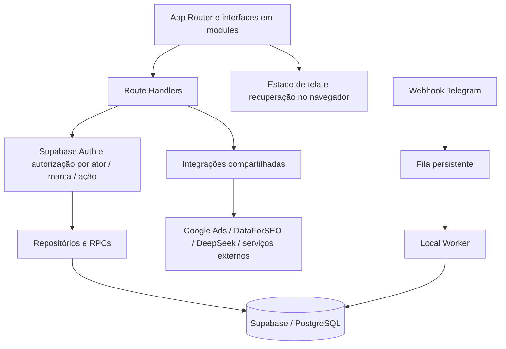

# Revisão geral do Minerador Key — 2026-09-04

**Módulo proprietário:** Plataforma / auditoria transversal.  
**Objeto:** checkout local de `C:\Users\scalb\Documentos\adalba-pro\minerador-key`.  
**Tipo:** diagnóstico e relatório; nenhuma correção funcional ou operação remota.  
**Inventário complementar:** [árvore, 90 APIs, 28 páginas e 65 migrations](inventario-tecnico-2026-09-04.md).

## 1. Parecer geral

O Minerador Key já possui uma implementação extensa de um monólito modular para planejamento editorial de SEO. A separação conceitual entre pesquisa de keywords, arquitetura, investigação, planejamento, redação e publicação é consistente. Existem regras determinísticas, contratos Zod, versionamento, infraestrutura de providers, autorização, persistência e interfaces reais. Não é somente um protótipo visual.

**Entretanto, o checkout ainda não demonstra um produto integralmente homologado, nem uma cadeia Marca → Publicações confiável de ponta a ponta.** O maior problema atual é a distância entre três camadas: o contrato canônico, os caminhos antigos ainda executáveis e a interface que efetivamente chama cada caminho. Há falhas concretas de autorização por objeto, uma integração incompleta de Site/Sitemap e verificações locais que não passam.

O banco consta como fundação remota concluída nos registros do projeto. **Esta revisão não encontrou motivo para reabrir o Master Refresh.** Encontrou necessidade de verificar pontualmente o catálogo atual e fechar os consumidores da fundação existente. Migration presente, tabela existente e botão renderizado continuam sendo evidências diferentes de uma funcionalidade concluída.

Prioridades propostas:

1. Tratar os achados de autorização por documento/versão e por ação antes de ampliar o uso multiusuário.
2. Fechar a integração de Site/Sitemap da Marca e estabelecer uma verificação local utilizável.
3. Seguir a ordem funcional aprovada, concluindo cada etapa com salvamento, readback, F5, isolamento e handoff reais.
4. Consolidar a documentação operacional e um checkpoint revisado do checkout, por execução do usuário.

Essas recomendações são diagnóstico. Não autorizam mudança estrutural, migration, exclusão, commit ou deploy.

## 2. Método e limites da evidência

Foram inventariados os diretórios de código, páginas, APIs e SQL; lidos os documentos de produto, arquitetura, regras compartilhadas, ADRs/SDDs relacionados e estados/backlogs das áreas; e inspecionados os caminhos de sessão, autorização, persistência, Site, workflow, documentos, publicações e integrações. A revisão anterior de 2 de setembro foi usada como pista e confrontada com o checkout atual.

A análise de código foi dirigida aos contratos e riscos principais. **Não foi uma leitura linha a linha de todos os arquivos nem um pentest exaustivo das 90 APIs.** O inventário completo de endpoints é sintático; os achados detalhados abaixo foram conferidos nos handlers e consumidores indicados.

Classificações usadas:

| Rótulo | Significado neste relatório |
|---|---|
| Verificado no código | Comportamento ou incompatibilidade encontrado no checkout |
| Confirmado por teste | Resultado local executado nesta revisão |
| Remoto documentado | Registro do repositório sobre uma validação ou aplicação anterior; não repetida nesta sessão |
| Pendente | Falta implementação, integração ou evidência operacional suficiente |
| Risco a verificar | Hipótese sustentada pelo código/SQL local que depende do ambiente ou de reprodução adicional |

Não foram lidos valores de `.env.local`, executados SQL ou migrations, feitas escritas remotas, chamadas pagas, instalações, login ou smoke autenticado. Não foram medidos volume real de dados, tamanho do banco, queries lentas, índices utilizados, backups, restauração, custos ou catálogo remoto atual. Não há declaração de segurança ou disponibilidade do Supabase ao vivo.

Não foi executado build: o typecheck já falha e o escopo foi a auditoria local, sem substituir os artefatos de desenvolvimento existentes. Navegador e responsividade autenticada não foram homologados. Código de aplicação e os estados/backlogs dos módulos funcionais foram preservados; os entregáveis são documentais.

## 3. Árvore e arquitetura

### 3.1 Organização real

| Camada | Volume observado | Responsabilidade |
|---|---:|---|
| `app/` | 133 arquivos; 90 handlers de API; 28 páginas | App Router, layouts, boundaries, autenticação e endpoints |
| `modules/` | 95 arquivos; 9 áreas físicas | Interfaces e coordenação das funcionalidades |
| `components/` | 38 arquivos | Shell, sessão, contextos, grids, editor e componentes compartilhados |
| `lib/` | 401 arquivos | Domínios, contratos, motores, recuperação, autorização, repositórios e providers |
| `tests/` | 377 arquivos; 366 `*.test.mts` | Testes de domínio, contratos, SQL e inspeção estática da interface |
| `supabase/` | 65 migrations, 139 arquivos em scripts e 9 em rollback | Histórico e pacotes operacionais de banco |
| `docs/` | 290 arquivos antes dos novos relatórios | Fontes canônicas, propostas, evidências e histórico |

Contagem física do checkout, incluindo arquivos não rastreados e documentação histórica. Não é tamanho do bundle nem contagem de tabelas remotas.

### 3.2 Stack e roteamento

- Next.js instalado: **16.3.0**; `package.json` declara `^16.2.10`. React declarado: **19.2.7**; TypeScript: **6.0.3**; Tailwind: **4.3.0**. A diferença entre versão mínima declarada e instalada não é, sozinha, defeito.
- Supabase JS + SSR; Zod 4; Tiptap 3; React Flow; SDKs Google; pnpm. Não há dependência `next-auth` no manifesto atual.
- Grupos de rota de Marca, Agência, Admin e área pessoal. A marca editorial é `marcas.id`; `brandRef = slug--uuid` transporta a referência na URL.
- `proxy.ts` renova a sessão e trata redirecionamentos antigos. APIs dependem dos próprios guards, pois ficam fora do matcher do proxy.
- `next.config.ts` aplica `noindex` e `private, no-store`. Isso é coerente com uma ferramenta privada de planejamento de SEO; não transforma o app no site público que receberá os artigos.
- A documentação local do Next para Route Handlers está disponível e foi consultada. A organização observada corresponde ao App Router.

### 3.3 Pontos fortes

O desenho de domínio preserva responsabilidades: Site observa, Minerador qualifica, Arquiteto forma, Radar investiga, Planejador decide a estrutura, Redator executa e Publicações registra a saída. Principal, slug, canonical e publicação têm contratos próprios. SiloDNA e SiloPage são separados. IA não equivale a aprovação.

Há primitivas importantes já implementadas: hashes e proveniência, cópias de trabalho, controle otimista por `lock_version`, sucessoras append-only, readback em caminhos canônicos, importação idempotente e helpers de isolamento. O Arquiteto utiliza RPCs transacionais para partes críticas do grafo e do silo. Não há necessidade demonstrada de separar o produto em microsserviços.

### 3.4 Dívida arquitetural

**A modularidade conceitual é maior que a modularidade da implementação.** `modules/arquiteto/arquiteto-workspace.tsx` tem aproximadamente **10.310 linhas**; o workspace do Minerador, **4.413**. Esses arquivos concentram estado, handlers, renderização e integração, aumentando a chance de uma alteração quebrar outro processo da mesma tela. Isso é risco de manutenção; não foi medido desempenho no navegador.

Coexistem `canonical-authorization.ts`, `authz.ts`, `tenant-context.ts`, `editorial-authorization.ts` e o runtime de autorização via RPC. Coexistem também os repositórios editoriais antigos e os repositórios canônicos do pipeline. A repetição já produz diferenças de permissão e de garantias de persistência.

`components/editorial-pipeline-context.tsx` ainda coordena várias etapas e contém recovery local e caminhos mock. Isso não prova que toda operação usa mock, mas exige rastrear qual ramo a interface executa. Um estado global `server/local_fallback` não substitui confirmação por artefato.

Recomendação: extração incremental por processo, preservando contratos e consumidores, depois de estabilizar o comportamento. Evitar uma refatoração geral simultânea das nove áreas.

## 4. Situação do banco de dados

### 4.1 O que se pode afirmar

| Área | Evidência disponível | Leitura correta |
|---|---|---|
| Master Refresh | AGENTS e mapa global: `DATABASE_REFRESH=COMPLETE`, baseline de 17/08, 0043/0044 fechadas | Fundação encerrada segundo os registros; não reexecutar refresh |
| Tenancy | SQL e runtime usam Marca, owner, memberships e helpers canônicos | Estrutura existe; guards de cada consumidor precisam ser conferidos |
| InternalLinkGraph | Docs registram readback, v1/v2, locks e isolamento cross-brand remoto | Fundação do grafo tem evidência anterior, distinta da homologação integral da interface |
| Telegram/Experts | Radar registra fundação e smoke JWT em 26/08 | Supera trechos administrativos antigos que ainda dizem migration pendente; inbound real continua separado |
| BrandSkill | Marca registra primeira Skill real com write/readback em 28/08 | Persistência de um rascunho comprovada nos registros; lifecycle/consumidores não ficam automaticamente homologados |
| Site/Sitemap | Marca registra A1 `20260902130000=APPLIED`, materialização PASS em 02/09 | Não deve continuar descrita como migration apenas local; integração da interface está incompleta |
| Silo transacional | Relatório Fase 2C informa `20260902140000` e `20260902150000` aplicadas remotamente | Registro documental de aplicação; não repetir essas migrations |
| Estado atual do catálogo, RLS e dados | Sem consulta remota nesta sessão | Ainda não verificado nesta auditoria |

Fontes: `docs/02-marca/estado-atual.md`, `docs/04-arquiteto/relatorio-fase-2c-silo-first.md`, `docs/05-radar/estado-atual.md` e mapa global. Entradas mais novas precisam ser lidas junto das antigas: a primeira seção de um documento nem sempre descreve o último estado.

### 4.2 Modelo de dados observado

| Domínio | Entidades principais nos contratos/SQL |
|---|---|
| Identidade e acesso | `auth.users`, `perfis`, `brand_roles`, `brand_memberships`, `brand_member_permissions` |
| Agência | `agencies`, `agency_memberships`, `agency_brands`, capabilities, restrições, convites, onboarding e períodos de acesso |
| Marca e Site | `marcas`; BrandDNA/BrandSkill como artefatos; `brand_site_sitemaps`, `brand_site_sync_runs`, `brand_site_catalog_entries`; especialistas |
| Minerador | `minerador_keywords`, `minerador_keyword_lists`, medições, discovery runs/candidates, imports e proveniência |
| Artefatos e workflow | `editorial_artifact_versions`, `editorial_workflow_items`, `editorial_version_status_events`, `editorial_decision_events`, views |
| Arquiteto / links | graphs, nodes, edges, proposals e working copies; silos e artigos versionados |
| Radar | snapshots e revisões SERP, análise/evidência em contratos e payloads do workflow |
| Especialistas / processamento | bindings Telegram, tokens, inbound ledger, briefs, contributions e `external_processing_jobs` |
| Redator | `content_documents`, `content_document_versions`, `content_document_user_states` |
| Publicações | `publication_records` |
| Integrações e comunicação | providers, connections, capabilities, grants, bindings, quotas, usage events; templates, mensagens e delivery events |

Essa tabela é um mapa lógico, não um inventário certificado do banco ao vivo. `briefings_artigos` ainda possui consumidor legado em API; nomes `keywords_kgr` e `listas_kgr` permanecem em migrations antigas e indevidamente em documentos ativos. O runtime novo usa as entidades renomeadas.

### 4.3 Garantias existentes e limites

O SQL possui RLS, privilégios explícitos, FKs restritivas, proteção append-only e guards de referência. A relação keyword → lista não deve apagar keywords quando uma lista é excluída. Artefatos publicados têm proteção estrutural. Isso representa uma fundação relevante.

**RLS não compensa uma autorização ausente no servidor quando a operação usa `service_role`.** O caminho canônico valida o ator e a ação antes de expor esse cliente; alguns caminhos editoriais antigos não verificam o pertencimento de todos os IDs recebidos. Os achados A1–A3 detalham a diferença.

### 4.4 Reprodutibilidade e governança SQL

1. **A pasta de migrations não é um roteiro seguro para recriar o ambiente do zero.** `0002/0003/0004` preservam propostas antigas e criam nomes também usados nas gerações canônicas. Migrations posteriores pressupõem tabelas e estado anteriores; vários pacotes usam gates específicos do remoto. Não foi executado `db reset` para reproduzir uma falha.
2. **Baseline não equivale a backup restaurável.** `supabase/baseline/` contém README e um resultado textual no checkout; o README aponta para `docs/SUPABASE_BASELINE.md`, inexistente. Não foi localizada ali uma baseline schema-only completa e reproduzível. Isso não afirma que o serviço remoto esteja sem backup.
3. **Papéis de agência exigem verificação do catálogo.** A 0014 declara `agency_admin/operator/viewer`; a 0016 acrescenta CHECK `agency_admin/agency_member`. Se ambos estiverem vigentes sem ajuste externo, sua interseção limita o papel a `agency_admin`. A divergência SQL é observável; o efeito atual no banco não foi testado.
4. **0046/0047 não devem ser executadas como uma sequência automática.** A 0047 tem precondições que recusam estruturas de lifecycle já presentes. O ledger e a condição exata de cada ambiente devem governar a operação, não a ordenação dos nomes.
5. **Rollback é desigual e histórico.** Há rollbacks distribuídos entre diretórios e documentos. Os de 0005/0006/0036 não podem ser repetidos, conforme a regra vigente. A existência de um rollback antigo não comprova reversibilidade do estado atual.

Próxima evidência útil: exportação somente leitura do ledger, tabelas/colunas, constraints, índices, FKs, RLS/policies, ACLs e assinaturas de RPCs no projeto correto, acompanhada da verificação de backup/restauração. Isso é uma conferência pontual da fundação, não um novo refresh. Não anexar dados pessoais nem segredos ao relatório.

## 5. Funcionalidades por área

| Área | Implementação observada | O que ainda falta para conclusão operacional |
|---|---|---|
| **Marca** | Identidade, BrandDNA, Skills, site/sitemap, catálogo, candidatas, equipe; repository remoto de Site e RPC de finalização | Fechar UI ↔ registro remoto ↔ sync ↔ snapshot; resolver concorrência; validar F5 e consumidores das Skills |
| **Minerador** | CSV/manual, discovery, Google Ads, DataForSEO allintitle/SERP, métricas/KGR, lógica, revisão semântica, decisão humana, lifecycle e handoff | Homologar lote KGR/conclusão de revisão, preservar métricas/readback e handoff; corrigir diagnóstico OAuth e testes defasados |
| **Arquiteto** | Formação de artigos, Território/Silo, principal e apoios, SERP/IA, cópias remotas, consolidação transacional, InternalLinkGraph | Completar aprovação própria da SiloPage; validar consolidação e links no navegador; confirmar handoff com todas as referências aprovadas |
| **Radar** | Coleta/curadoria SERP, análise, revisão, histórico, readback e contrato v2 para o Planejador | Fechar evidências externas/especialistas e pacote aprovado real; inbound Telegram/transcrição E2E; jornada consolidada até o Planejador |
| **Planejador** | ContentPlan determinístico v2, editor por seções, fontes, restrições e plano visual | Primeiro plano real salvo, recarregado, aprovado e transferido; confirmar adaptação/persistência do handoff e leitura do grafo |
| **Redator** | Tiptap, escrita por seção, melhoria, Guardião, autosave, snapshots e recovery | Corrigir autorização por documento e aprovação; validar concorrência, versões, reload e transferência real |
| **Publicações** | Biblioteca/fila, importação, exportação Markdown/JSON/CSV, URL manual, histórico e reedição | Primeiro documento real e URL externa conferidos; integração CMS precisa de escopo/destino próprios |
| **Conta** | Supabase SSR, perfil pessoal, nome/avatar e contextos de acesso | Homologação de sessão completa, upload/readback e fluxos de segurança; documentação antiga ainda descreve NextAuth |
| **Admin / Agência** | Gestão de usuários/contextos, integrações, convites, comunicação e governança | Confirmar matriz de permissões nos caminhos antigos, ciclo de convites e política operacional de recursos |

O Minerador apresenta a evidência operacional mais forte: o estado de 03/09 registra rotação de token Google Ads, health check e Metrics persistindo/refletindo na tabela. O Arquiteto tem implementação extensa, mas extensão de código não representa fechamento de todos os gates. Planejador, Redator e Publicações ainda precisam de uma jornada integrada demonstrada.

No Arquiteto, `SILO_PAGE_APPROVAL_UI=MISSING` está explicitamente registrado na Fase 2C. Aprovar o SiloDNA não supre essa decisão. No código já existem projeções e operações de Links Internos; descrevê-las simplesmente como inexistentes seria impreciso, assim como declará-las homologadas só porque o banco está pronto.

## 6. APIs e serviços externos

### 6.1 Superfície interna

São **90 arquivos de API**, além de handlers de autenticação fora de `app/api`. O inventário anexo lista cada endpoint e método exportado.

| Família | Quantidade de handlers | Papel |
|---|---:|---|
| `/api/arquiteto/**` | 21 | Workspace, formação, SERP, consolidação, grafo e handoff |
| `/api/minerador/**` | 12 | Discovery, métricas, allintitle, IA e lifecycle |
| `/api/editorial/**` | 11 | Workspace, workflow, SERP, análise, documentos, views e especialistas |
| `/api/marca/**` | 9 | BrandDNA, Skills e Site |
| `/api/admin/**` | 8 | Usuários, administração, comunicação e integrações |
| Demais famílias | 29 | Agência, Auth, contextos, onboarding, Redator, Publicações e compatibilidade |

O padrão mais consistente combina schema de entrada, `resolvePipelineContext`, permissão por ação, repository tenantizado e readback. O padrão antigo frequentemente combina sessão, autorização genérica da marca e escrita por `service_role`; requer revisão por objeto e efeito produzido.

`/api/mine` retorna **410 / DISABLED**: a exportação Google Sheets antiga não está operacional. `next-auth` não consta no manifesto, enquanto a sessão ativa usa Supabase SSR; referências documentais antigas não devem orientar uma nova instalação ou restauração desse caminho.

### 6.2 Providers

| Integração | Código / propósito | Limite da evidência |
|---|---|---|
| Supabase | Auth, PostgreSQL, RPCs, Storage e segredos server-side | Catálogo e saúde remotos não consultados nesta sessão |
| Google Ads | Pesquisa e métricas; configuração global e refresh token no Secret Store | Smoke de Metrics/rotação registrado em 03/09; nova execução não feita |
| DataForSEO | Allintitle, compatibilidade e investigação SERP | Provider canônico; homologação depende da operação e módulo |
| DeepSeek | IA estruturada/textual e propostas editoriais | Resolver, catálogo e adapters existentes; nenhuma geração real nesta auditoria |
| Speech / Storage / YouTube | Transcrição, mídia e metadata | Connections READY documentadas; operação E2E não é inferida desse status |
| Telegram | Bot global, webhook, binding, briefs, ledger e fila | Fundação documentada; webhook/inbound real e processamento continuam gates separados |
| Resend / comunicação | Templates, outbox e entrega transacional | Implementação presente; entregabilidade atual não testada |
| Google Sheets | Rota de compatibilidade desabilitada | Precisa de integração server-side própria para voltar a operar |

**Política de consumo:** `lib/server/integrations-runtime.ts:28` fixa `HOMOLOGATION_ALLOW_ALL`. Para os providers mapeados, o resolver seleciona uma Connection global READY e devolve quota ilimitada, mesmo havendo código de grants/bindings/quotas. Isso é um modo explícito de homologação, não evidência de API pública sem autenticação. Porém, a configuração de quotas na interface não deve ser entendida como limite efetivamente aplicado nesse caminho. Validar a política comercial antes de ampliar o uso pago.

## 7. Achados prioritários

### A1 — Redator: autorização da marca não vincula o documento alterado — prioridade alta

**Verificado no código.** `app/api/editorial/documents/route.ts` autoriza `input.brandId`, mas chama `ContentDocumentRepository.save(input.documentId, ...)`. Em `lib/server/editorial-repositories.ts:270`, o UPDATE filtra somente `id` e `lock_version`, sem `marca_id`. O cliente em `editorial-db.ts` usa `service_role`. O POST de estado do editor também recebe `documentId` sem resolver seu tenant.

**Efeito:** com um ID/lock de documento de outra marca, o guard de uma marca autorizada não impede, por si só, a alteração desse objeto. Não foi feita exploração remota; possíveis proteções extras do catálogo ao vivo não foram verificadas. A lacuna no servidor é concreta e não deve depender de segredo do ID.

**Critério de correção:** resolver o documento da marca autorizada antes da operação e manter filtro de tenant em save/version/user-state; testes negativos com duas marcas, mesmo usuário e usuários distintos; nenhuma escrita fora do tenant.

### A2 — Workflow: eventos de versão não são vinculados à marca aprovada — prioridade alta

**Verificado no código.** `approve_plan` encaminha `command.versionEvents` a `ArtifactRepository.appendEvents`. Esse método, em `editorial-repositories.ts:71`, descarta `marcaId` (`void marcaId`) e persiste os `version_id` recebidos. O schema aceita `plannerItemIds: []`; a etapa de append não depende de um item efetivamente aprovado no loop. O SQL local do evento contém FK simples para a versão, sem `marca_id` no evento.

**Efeito:** o caminho pode registrar status para uma versão fora do conjunto de planos autorizado. Com `service_role`, a policy de leitura tenantizada não resolve a ausência de validação da mutação.

**Critério de correção:** produzir os eventos a partir das versões canônicas realmente aprovadas, conferir tenant e relação com os itens, rejeitar IDs adicionais e validar a transição. Cobrir lista vazia, versão de outra marca e repetição idempotente.

### A3 — Ação efetiva pode exigir mais privilégio que o guard — prioridade alta

**Verificado no código.** O PUT de documentos exige `redator:edit`, mas aceita `document.status === 'aprovado'`; o Guardião verifica conteúdo bloqueante, não a permissão humana de aprovar. `/api/analyze` verifica acesso à marca e pertencimento da keyword, chama IA e grava análise, sem exigir explicitamente `minerador:edit` no handler. `assertCanAccessMarca` aceita membership ativa, não permissão de edição.

**Efeito:** acesso à marca e qualidade do conteúdo podem ser confundidos com autorização para executar uma ação privilegiada. O runtime de recursos não deve substituir a permissão editorial específica.

**Critério de correção:** mapear o efeito de cada operação para a ação canônica, exigir `approve` na aprovação e permissão de mutação nas análises que gravam; testar usuário somente leitura, editor e aprovador. A consolidação transversal deve seguir a SDD/gate aplicável.

### A4 — Site/Sitemap: contrato remoto e interface não fecham o fluxo — prioridade alta

**Verificado no código.** `modules/marca/site-sitemap-panel.tsx:161` cadastra via `addSitemap` e grava recovery local. Já existe POST remoto em `/api/marca/site/sitemap`, mas esse cadastro da tela não o utiliza. O sync exige que o `sitemapId` exista remotamente. Além disso, a tela, na linha 170, espera `body.run.status` e o contrato antigo de merge; a rota de sync retorna `runId`, `finalization` e `snapshot`, sem `run`.

**Efeito:** sitemap criado pelo fluxo local pode ser recusado pelo servidor; mesmo um sync remoto bem-sucedido pode produzir erro no cliente ao interpretar a resposta. A leitura de `remoteSnapshot` não migra integralmente as listas/candidatas e ações ainda baseadas em `workspace` local.

**Critério de correção:** registro remoto com ID confirmado, resposta compartilhada tipada, hidratação canônica e ação de sync coerente; verificar cadastro → sync → catálogo → F5 → importação. A suíte `test:marca` passou 106/106 e não detectou esta incompatibilidade integrada.

### A5 — Site: concorrência e leitura completa do catálogo — prioridade média/alta

**Verificado no código; efeito concorrente não reproduzido.** `startBrandSiteSync`, em `lib/server/marca-site-store.ts:197`, faz SELECT de `running` por sitemap e depois INSERT em chamadas separadas. As migrations de Site inspecionadas não declaram unicidade de execução `running` por marca. Duas requisições simultâneas podem passar pelo SELECT; sitemaps distintos também podem compartilhar URLs do catálogo da mesma marca. O backlog já reconhece esse gate.

O snapshot e a ingestão consultam todo o catálogo com `.select('*')`, sem paginação explícita, enquanto o crawler admite até 10.000 URLs. **Risco a verificar:** se o limite PostgREST do projeto for menor que o catálogo, haverá leitura incompleta. Não se afirmou qual é o limite remoto atual.

**Critério de correção:** exclusividade no escopo definido pelo contrato, garantida atomicamente; teste de concorrência e de recuperação após falha; leitura paginada/completa com catálogo acima do limite de uma resposta. Mudança SQL depende de adendo aprovado.

### A6 — Handoffs e salvamentos antigos fazem múltiplas escritas sem unidade atômica — prioridade média/alta

**Verificado no código.** `/api/editorial/workflow` combina save de artefato, import, transição e append de eventos em chamadas independentes. O PUT de documentos salva, cria versão e sincroniza publicação separadamente.

**Efeito possível:** uma falha intermediária deixa parte da operação persistida e parte pendente; o cliente recebe erro apesar de já haver mudanças. A atomicidade presente nas RPCs do Arquiteto não se estende automaticamente ao restante do pipeline.

**Critério de correção:** escolher contrato transacional ou recuperação idempotente por operação, identificar o que foi confirmado e testar falha entre etapas. Não presumir que retry do handler completo é seguro.

### A7 — Verificações locais não oferecem uma aprovação global — prioridade alta para entrega

**Confirmado por teste.** TypeScript, lint e quatro das sete suítes executadas conforme os scripts falham. A execução ampla ainda encontra problemas de loader e testes defasados. Detalhes e números na seção 8.

**Critério de correção:** classificar falhas por implementação, fixture antiga e infraestrutura de teste; corrigir a causa sem eliminar gates válidos. Fazer o comando principal cobrir as suítes acordadas e manter os testes remotos perigosos isolados.

### A8 — Documentação e estado do checkout dificultam distinguir o vigente — prioridade média

**Verificado.** Documentos ativos ainda falam de `keywords_kgr`, NextAuth, migration 0002 e fases já superadas. O backlog global ainda pede escolher a primeira área funcional. Ao mesmo tempo, há entradas recentes de execução em Marca, Minerador e Arquiteto. A revisão anterior não deve ser copiada sem revalidação.

O snapshot inicial de Git apresentou **1.885 entradas**: 240 modificadas, 1.088 excluídas e 557 não rastreadas; 1.005 entradas pertencem a `.next-codex-verify`. São entradas de `git status`, e uma entrada não rastreada pode representar um diretório. Não confundir essas contagens com alterações desta auditoria. Nenhuma delas foi revertida ou consolidada pelo agente.

**Critério de correção:** estado resumido vigente por módulo, histórico claramente subordinado e referência às evidências. Usuário revisar um checkpoint e a situação dos artefatos gerados, sem limpeza automática. Este relatório não autoriza remoção de arquivos.

## 8. Qualidade: resultados desta revisão

### 8.1 Comandos e resultados

| Verificação | Resultado |
|---|---|
| TypeScript: `node node_modules/typescript/bin/tsc --noEmit --incremental false` | **5 erros**, exit 2 |
| ESLint: `node node_modules/eslint/bin/eslint.js app modules components lib proxy.ts next.config.ts` | **86 erros e 64 avisos**, exit 1 |
| `test:authz` | 25 testes; **23 passaram / 2 falharam** |
| `test:arquiteto` | 1.363 testes; **1.361 passaram / 2 falharam** |
| `test:marca` | **106/106 passaram** |
| `test:editorial` | 20 testes; **16 passaram / 4 falharam** |
| `test:redator` | **3/3 passaram** |
| `test:operational` | 50 testes; **41 passaram / 9 falharam** |
| `test:integrations-runtime`, com loader do projeto | **28/28 passaram** |
| Varredura `node --test --test-reporter=tap "tests/*.test.mts"` | 3.032 resultados; **2.944 passaram / 88 falharam** |
| `node scripts/check-visual-system.mjs` | Exit 1: termo proibido em comentário na linha 166 de `territorial-workspace-rows.tsx` |
| Build, browser autenticado, banco e providers reais | **Não executados** |

As sete suítes foram executadas individualmente com os mesmos argumentos de `package.json`, incluindo o loader específico de integrações. Assim foi possível ver falhas posteriores sem o curto-circuito do script `test`, que usa `&&`. Elas somam 1.595 resultados, com 17 falhas, e se sobrepõem à varredura ampla: **não somar ambas como testes distintos**.

A varredura ampla é uma avaliação de descobribilidade, não um runner canônico novo. Ela inclui falhas de resolução de alias `@/`, suporte TS/TSX e importação server-only, além de asserções. Portanto, **88 falhas não equivalem a 88 bugs do produto**. O caso `integrations-runtime` falha na varredura simples, mas passa com seu loader declarado.

O guard visual apontou um comentário dizendo para não usar a cor proibida, não uma cor renderizada demonstrada. Continua sendo uma falha real do guard atual; não é prova de defeito visual na tela. O teste automatizado não substitui inspeção de interface.

### 8.2 Erros de TypeScript

- `components/editorial/dna-panels.tsx:1146`: `unknown` atribuído a `string | null`.
- `lib/minerador/keyword-qualification.ts:157`: `semantic` opcional/nulo passado a contrato que o exige.
- `tests/agency-adalba-platform-internal.test.mts:167`, `:200`, `:201`: regex exige ES2018+, enquanto o target é ES2017.

### 8.3 Cobertura e confiança

Somente **103 dos 366 arquivos `*.test.mts`** foram encontrados por referência textual nos scripts do manifesto. Isso não é cobertura percentual de código, nem prova de que os demais nunca sejam executados manualmente. Mostra que o comando padrão não descobre automaticamente toda a suíte; `test:marca` e `test:integrations-runtime` também não integram a cadeia principal `test`.

Muitos testes verificam strings de código, estrutura e vocabulário de UI. São úteis como regressão localizada, mas podem falhar após uma refatoração correta ou passar apesar de uma API e sua tela estarem incompatíveis. Os próximos testes de maior valor são fronteira tenantizada por objeto, contrato request/response consumido pela UI, falhas parciais, concorrência e handoff real.

`tests/run-all.js`, associado ao teste real de banco, lê credenciais e tenta DELETE/PATCH em registros publicados reais. **Não foi executado.** Não deve ser usado como verificação automática inofensiva.

## 9. Sequência proposta para fechar o produto

| Ordem | Recorte | Evidência de conclusão |
|---|---|---|
| Gate de segurança | A1–A3: documento, versão, marca e ação | Testes negativos cross-brand e por papel; escrita sempre vinculada ao objeto autorizado |
| Preparação da entrega | TypeScript, lint, runner e triagem das falhas | Comandos reproduzíveis com resultados compreendidos; checkpoint revisado pelo usuário |
| 1 — Marca | Site/Sitemap e consumo de BrandDNA/Skills | Registro remoto, sync, catálogo íntegro, F5 e origem confirmada pelo consumidor |
| 2 — Minerador | Qualificação/revisão em lote e handoff | Importação idempotente, métricas preservadas, KeywordDNA rastreável e nenhuma keyword perdida |
| 3 — Arquiteto | Formação, aprovação própria de SiloPage, grafo e envio | Cópia remota, aprovação humana, sucessora, conflito concorrente e referências válidas no Radar |
| 4 — Radar | Evidências e pacote consolidado | SERP revisada, proveniência e pacote aprovado salvo/readback; Experts em gate E2E separado |
| 5 — Planejador | Primeiro ContentPlan completo | Salvar, recarregar, aprovar e transferir com referências/evidências preservadas |
| 6 — Redator | Primeiro documento completo | Autosave e conflito reais, aprovação autorizada, versões e handoff idempotente |
| 7 — Publicações | Primeiro ciclo de exportação/registro | Documento aprovado exportado; URL, slug e canonical preservados; destino verificado pelo usuário |

O gate de segurança é uma dependência técnica comprovada pelo código; não substitui a ordem funcional nem abre uma reforma da fundação. Cada correção deve declarar seu módulo proprietário. Mudança de autorização, persistência, workflow ou SQL segue SDD/adendo e autorização aplicável.

Não é útil atribuir um percentual global de prontidão: a distribuição de implementação é desigual e uma falha de autorização ou um handoff quebrado pesa mais que dezenas de controles concluídos. O marco adequado é **uma jornada editorial pequena, real e rastreável, concluída de ponta a ponta**, com isolamento entre duas marcas e recuperação após F5.

## 10. Referências e manutenção deste relatório

Fontes principais: `docs/00-produto/{invariantes,glossario,fluxo-oficial,arquitetura,mapa-estado-atual-plataforma,pipeline-editorial-papeis-handoffs}.md`; ADRs 007, 019 e 021; regras de trabalho/documentação; SDDs canônicas de identidade e integrações; contrato de Links Internos; documentos de estado/backlog por área; relatório Fase 2C; migrations e handlers citados.

A revisão de 02/09 permanece histórica. Esta revisão atualiza evidências importantes: 90 APIs no checkout, cinco erros TypeScript confirmados, novos resultados de testes, materialização documentada de Site/Silo e novos consumidores remotos de Site ainda incompatíveis com a tela.

**Entregáveis desta tarefa:** este relatório, o inventário técnico anexo e referência no backlog global. Sem alteração de contrato, código, estado remoto ou status funcional de módulos. Os resultados descrevem o snapshot auditado; mudanças posteriores exigem nova verificação direcionada.
