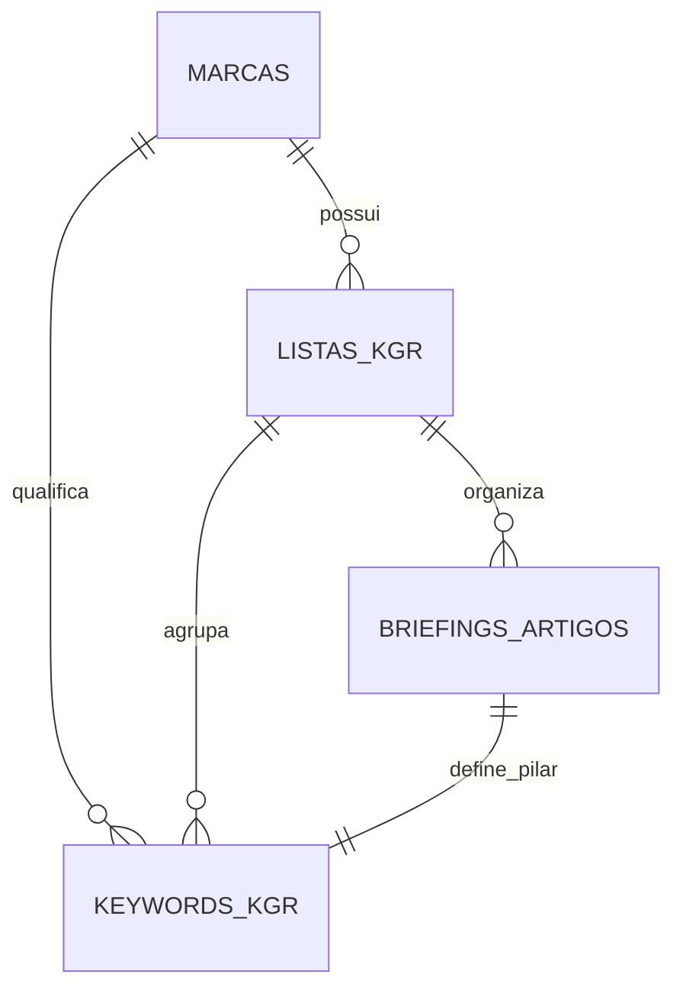

# Agent Handoff & Raio-X do Sistema (Minerador Pro)

Este documento descreve a especificação técnica atualizada, o propósito do produto e a arquitetura real do **Minerador Pro** (SaaS de SEO estratégico), servindo como guia de integração (Handoff) para agentes de desenvolvimento subsequentes.

---

## 1. Propósito do Aplicativo
O **Minerador Pro** é uma ferramenta de SEO de alta densidade e TDAH-friendly focada em duas missões cruciais:
1. **Qualificação de Keywords (Etapa 1 - Minerador):** Encontrar oportunidades de baixo esforço e alta conversão através da qualificação do KGR (*Keyword Golden Ratio*) e intenção semântica.
2. **Prevenção de Canibalização e Estrutura de Silos (Etapa 2 - Arquiteto):** Organizar o ecossistema de conteúdo de uma marca. A ferramenta utiliza artigos já publicados como "ímãs" (âncoras), fazendo novas palavras orbitarem como suporte a esses artigos existentes para expandir autoridade sem duplicar intenções de busca.

---

## 2. Raio-X da Arquitetura de Dados (Supabase)

O banco de dados armazena a estrutura hierárquica baseada nos seguintes modelos:

*   **`marcas`**: Cadastro do cliente/marca sob gestão. Contém a URL do site e o array `silos_existentes` (nome e slug) que reflete os silos ativos.
*   **`listas_kgr` (Silos/Categorias)**: Grupos macro organizacionais vinculados a uma marca (Ex: "Marketing Médico", "Tráfego Orgânico").
*   **`keywords_kgr` (DNA da Keyword)**: Os termos minerados na Etapa 1.
    *   *Colunas:* `id`, `keyword`, `volume_search`, `results_allintitle`, `kgr_score`, `intent`, `status` (`bruto`, `aprovado`, `rejeitado`, `publicado`), `lista_id` (silo), `analise_semantica`.
    *   *`analise_semantica` (JSONB):* Contém o DNA Semântico individual da keyword gerado na etapa 1: `perfil_b2b`, `emocao_dominante`, `nivel_consciencia`, `objecao_implicita`, `gatilho_de_conversao`.
*   **`briefings_artigos` (DNA do Artigo / Briefings)**: Entidade central que une keywords.
    *   *Colunas:* `id`, `keyword_principal`, `slug_sugerido`, `hierarquia` (`Pilar`, `Suporte 0`, `Reforço Narrativo`), `meta_title`, `meta_description`, `diretrizes_estrategicas` (`angulo_de_venda`, `chamada_para_acao`, `angulo_anti_canibalizacao`), `silo_id`, `keywords_secundarias` (array de strings).

---

## 3. Funcionamento das Etapas

### Etapa 1: Minerador Key (`/minerador`)
*   **Propósito:** Limpar, ordenar, classificar e aprovar termos brutos.
*   **Importação:** Suporta upload de CSV estruturado ou colagem manual em lote.
*   **Metadados Locais:** Auto-detecta e classifica a intenção de busca (Informativo, Comercial, Vendas) e o nicho de forma instantânea em segundo plano na entrada caso venham zerados.
*   **Qualificação KGR:** Calcula a fórmula do KGR `(results_allintitle / volume_search)`. Termos abaixo de `0.25` são sinalizados em verde (fáceis de ranquear).
*   **Ações de Planilha:** Mapeamento de status e atribuição em massa de silos/listas.

### Etapa 2: Arquiteto de Conteúdo (`/arquiteto`)
*   **Propósito:** Desenhar a arquitetura de informação do site.
*   **Fusão Inteligente de Dados:** Carrega em paralelo os artigos publicados de briefings (`briefings_artigos`) e as keywords ativas do minerador (`keywords_kgr` com status `publicado` ou `aprovado`). Mescla ambos por similaridade léxica evitando duplicações, garantindo que mesmo os publicados que não possuam briefing completo no banco ainda sirvam como âncoras.
*   **Algoritmo Léxico (Client-Side):**
    *   Identifica palavras com status `publicado` e as fixa como **Artigos Âncoras (Imutáveis)**.
    *   Itera sobre as novas palavras `aprovadas`. Se compartilharem mais de `50%` de similaridade léxica (Token Overlap) com algum artigo publicado, elas orbitam ao redor dele como **Reforço Narrativo**, adotando automaticamente o slug do artigo publicado para evitar canibalização.
    *   Se não compartilharem similaridade com nenhum publicado, agrupam-se entre si formando **Novos Artigos** sugeridos.
*   **Agrupamento de Silos:** Preserva os silos reais já atribuídos no banco aos artigos publicados e cria novos grupos semânticos apenas para os artigos novos restantes.

---

## 4. Padrões de UI/UX e Design System
A interface foi projetada especificamente para usuários com TDAH, prezando por alta densidade, minimalismo e zero ruído cognitivo.

### Design de Barra de Topo Única (Single Top Bar)
*   Para evitar barras duplas empilhadas, o layout global não possui navegação permanente.
*   Cada página (`/minerador` e `/arquiteto`) renderiza **uma única barra no topo (`h-10`)**:
    *   **Lado Esquerdo/Centro:** Ferramentas operacionais de planilha visíveis diretamente em linha (busca rápida, filtros, botões de ação como Carregar, Gerar, Importar, Exportar).
    *   **Lado Direito:** Um menu **Hamburger (≡)** discreto que recolhe toda a navegabilidade e configurações globais (Perfil do usuário, Links das Etapas do SaaS, Seletor de Marcas/Clientes ativo e Logout).

### DataGrid de Artigos
*   No Arquiteto, a tabela principal não exibe mais palavras soltas. **Cada linha representa exatamente um Artigo (Cluster)**.
*   **Cores de Linha Inteiras:** O background inteiro (`<tr>`) recebe uma cor de destaque suave (`bg-indigo-900/[.12]`, etc.) estável por artigo para facilitar o escaneamento visual rápido.
*   **Imutabilidade do Passado:** Se o artigo for "Publicado", seu slug e silo ficam desabilitados para edição. Se for "Novo", são inputs e seletores ativos.
*   **Abas Internas no Acordeão:**
    *   Ao expandir um artigo (Chevron), revela-se um painel contendo duas abas:
        *   **Aba 1 (Keywords de Suporte):** Sub-tabela limpa exibindo as keywords secundárias vinculadas a este artigo. Cada keyword possui um acordeão interno que exibe o seu **DNA Semântico de Keyword** (Etapa 1).
        *   **Aba 2 (DNA do Artigo):** Formulário integrado onde o usuário visualiza, edita e salva as diretrizes de briefing (*Meta Title, Meta Description, Ângulo de Venda, CTA, Ângulo Anti-Canibalização*) diretamente na tabela, sem slide-overs ou popups.

---

## 5. Diretrizes para o Próximo Agente

1.  **Preservação de Imutabilidade:** Nunca altere a lógica que bloqueia a edição de slugs e silos de artigos que já estão marcados com o status `publicado`.
2.  **Consistência de Layout:** Mantenha o padrão de barra única (`h-10`) com ferramentas locais na esquerda/centro e o Hamburger de Navegabilidade na extrema direita em qualquer página nova.
3.  **Deduplicação de Hydration:** Ao realizar edições em tabelas (`thead`, `tbody`), tome cuidado extra com nós de texto inválidos (comentários HTML soltos entre tags React quebram o Next.js).
4.  **Preservação dos 3 DNAs:** Qualquer alteração na lógica de briefings deve garantir que o DNA Semântico individual das keywords (Etapa 1) e o DNA consolidado do Artigo (Etapa 2) continuem separados e visíveis de forma independente.

---

## Checkpoint de Segurança - 30/06/2026

A regra "publicado é sagrado" foi validada com sucesso.

Resultado dos testes:

Total: 13 | PASS: 13 | FAIL: 0 | SKIP: 0

Proteções confirmadas:
- DELETE de keyword publicada bloqueado no banco
- rebaixamento de status publicado bloqueado
- movimentação de silo de publicado bloqueada
- alteração textual de keyword publicada bloqueada
- DELETE de lista/silo com publicado bloqueado
- DELETE de marca com publicado bloqueado
- APIs sensíveis exigem sessão
- DELETE /api/marcas com conteúdo publicado retorna 409

A partir deste ponto, a segunda etapa pode usar os publicados como âncoras imutáveis.

### Artefatos de segurança criados nesta sprint

- **Migration SQL:** `supabase/migrations/0001_protect_publicado.sql` — triggers `protect_published_keyword`, `protect_published_lista`, `protect_marca_with_published`, `protect_published_briefing` (aplicada no banco).
- **Helper de autorização:** `lib/server/authz.ts` — `requireSessionProfile`, `assertCanAccessMarca`, `assertKeywordBelongsToMarca`, `assertListaBelongsToMarca`, `assertNotPublishedKeyword`, `marcaHasPublished`, `AuthzError`. Toda API sensível deve usar este helper.
- **Testes de regressão:** `tests/run-all.js` + `pnpm test` — 13 testes que validam as proteções contra o banco real e a API local. Credenciais de login automático em `.env.local` (`TEST_AUTH_EMAIL` / `TEST_AUTH_PASSWORD`).
- **KGR:** fallback de `Math.random()` removido do `minerador/page.tsx`; dados sem fonte real recebem `volume_source='estimado'` + badge "Estimado" + aviso na publicação.
- **Login:** formulário na landing page (`app/page.tsx`) + `NEXTAUTH_SECRET` estável no `.env.local` (sessões persistem entre restarts).

### Regra absoluta para o desenvolvimento da Etapa 2

Todo item com `status = 'publicado'` é **âncora imutável**. Nenhuma ação — visual, lógica ou API — pode tentar alterar `slug`, `silo` (`lista_id`/`silo_id`), `keyword principal` ou `status` de um item publicado. Essa proteção mora no banco (triggers) e nas APIs (`lib/server/authz.ts`), não apenas no front-end. Campos editoriais (`intent`, `analise_semantica`, `hierarquia`, metas/diretrizes) continuam editáveis.
