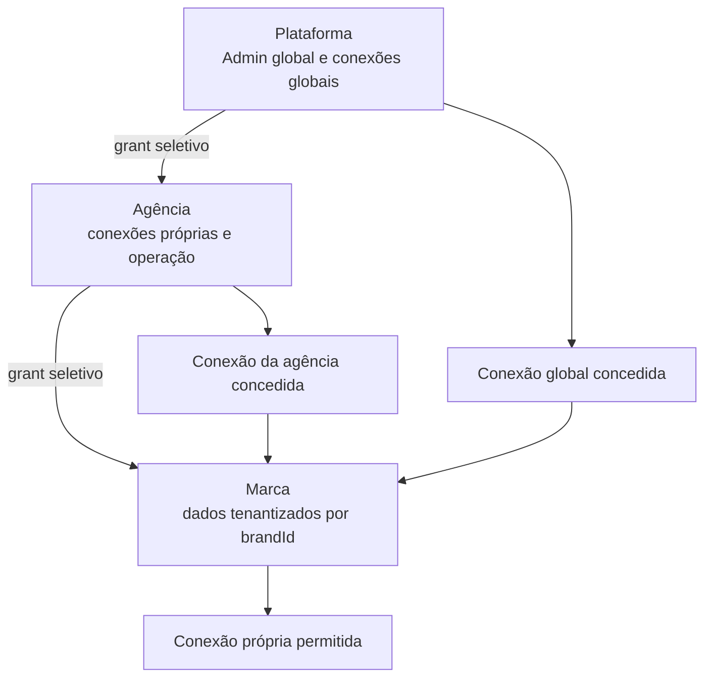

# SDD — arquitetura de integrações: plataforma, agência e marca

- **Status:** Aprovada para planejamento estrutural — não autoriza implementação, migration ou operação remota.
- **Módulo proprietário:** Arquitetura compartilhada / Integrações
- **Data:** 2026-08-06
- **Escopo:** contratos conceituais de conexões, capacidades, grants, bindings, consumo, segurança e transferência de marca
- **Fora do escopo:** código, schema, migrations, RLS, provider, segredo, UI, rota, teste de conexão e operação remota

## 1. Decisão arquitetônica

A arquitetura final admite conexões em três escopos exclusivos: `platform`, `agency` e `brand`. Uma conexão possui exatamente um escopo proprietário e não muda de owner por compartilhamento. Compartilhar significa conceder uso de uma mesma conexão; não copia credencial, token ou segredo.

`brandId = public.marcas.id` continua sendo o tenant dos dados produzidos. `agencyId` organiza operação, conexão própria, grants e consumo. `actorUserId = auth.uid()` identifica quem iniciou ou administrou uma ação. `platform_admin` permanece escopo de plataforma, distinto de agência, marca e owner.



## 2. Regras inegociáveis

1. Cada conexão tem um único owner de escopo: plataforma, agência ou marca.
2. Segredos ficam criptografados em repouso, com chave fora do banco, e só são decriptados server-side para uso necessário.
3. Leitura de conexão nunca retorna segredo; browser, Extensão e logs nunca recebem segredo, token ou Authorization.
4. Plataforma concede conexões globais a agências e marcas autorizadas conforme política explícita; agência concede apenas conexões próprias seletivamente a marcas.
5. Marca pode manter conexão própria quando a capability permitir.
6. A origem efetiva é explícita: `platform_granted`, `agency_owned`, `agency_granted`, `brand_owned` ou `unavailable`.
7. Não há fallback silencioso. Falha da origem escolhida retorna erro explícito e preserva o estado anterior.
8. Troca de origem é administrativa, auditada e não altera os dados editoriais já produzidos.
9. Toda operação registra `connectionId`, `sourceScope`, `actorUserId`, capability, módulo, ambiente, quantidade, custo e status. `agencyId` é obrigatório quando a operação pertence a uma agência ou é executada para marca vinculada a uma agência. `brandId` é obrigatório em `module_operation` e pode ser nulo somente em `connection_test`, `health_check` ou `administrative_validation`; nesse caso nenhum dado editorial é criado, o escopo proprietário e `actorUserId` são obrigatórios, `agencyId` é obrigatório para teste de agência e logs/usage events permanecem sanitizados.
10. Marca possui exatamente uma agência operacional `active`; transferência preserva `brandId`, dados e conexões próprias.
11. Serper e RapidAPI já estão fora da arquitetura. Toda referência restante é resíduo inválido a eliminar por prova de ausência; não há provider de transição, paridade futura, gate produtivo de corte ou fallback para eles.

## 3. Ambiente de deployment e conexões operacionais

Variáveis de ambiente e configuração de Vercel servem à infraestrutura de deployment e, quando aprovadas como infraestrutura fixa da Plataforma, à configuração server-side de um provider. Elas nunca são cadastro operacional de Agency ou Brand, não chegam ao browser e não substituem autorização, governança de consumo ou auditoria.

`GOOGLE_ADS_CONFIG_SOURCE = PLATFORM_ENV` é o destino aprovado para a infraestrutura fixa do Google Ads: `.env.local` em desenvolvimento e Environment Variables da Vercel em produção. O contrato atual prevê `GOOGLE_ADS_DEVELOPER_TOKEN`, `GOOGLE_ADS_CLIENT_ID`, `GOOGLE_ADS_CLIENT_SECRET`, `GOOGLE_ADS_REFRESH_TOKEN`, `GOOGLE_ADS_LOGIN_CUSTOMER_ID` e `GOOGLE_ADS_RESEARCH_CUSTOMER_ID`; `GOOGLE_ADS_API_VERSION` pode permanecer como parâmetro técnico se o runtime ainda o consumir. Nenhuma variável é `NEXT_PUBLIC_`.

Essa decisão é um target aprovado e não declara remoção já validada de Connection, Vault, `secret_ref`, grant, binding, entitlement ou tabela legada do código. O smoke autenticado e a prova de ausência de consumidores continuam sendo gates separados. DataForSEO e OpenRouter permanecem Connections governáveis; seus segredos operacionais não devem voltar a env como fallback silencioso.

## 4. Superfícies administrativas futuras

As rotas abaixo são contratos de interface futuros; esta SDD não as implementa nem autoriza criação de rota:

| Superfície | Responsabilidade |
| --- | --- |
| `/admin/integracoes` | conexões globais, grants, ambientes, limites e uso da plataforma |
| `/agencias/{agencyRef}/integracoes` | conexões próprias da agência, grants para marcas, uso e rotação/revogação da agência |
| `/{brandRef}/integracoes` | WordPress, IA própria, ferramentas da marca, conexões herdadas e origem/status efetivos |

Nenhuma superfície lê ou devolve segredo. Todas mostram somente metadados sanitizados, owner, capability, ambiente, estado, validade, limites, uso, custo e a origem efetiva. Ações de cadastro, teste, rotação, revogação, grant ou binding exigem autorização explícita do escopo.

## 5. Matriz de escopo por integração

| Integração | Contrato atual/legado | Destino canônico | Origem permitida | Dados produzidos | Estado |
| --- | --- | --- | --- | --- | --- |
| Google Ads | configuração/medição por marca e refresh token operacional em contrato legado | infraestrutura fixa da Plataforma via `PLATFORM_ENV`; Research Customer global executa pesquisa e `brandId` permanece dono dos dados | `all_active_agencies` durante homologação; futura governança de quantidade/período | por `brandId`; consumo atribuído à agência e marca | target aprovado; smoke pendente |
| DataForSEO | credencial operacional por env em contrato legado | Connection global da Plataforma ou Connection própria de Agency, sem fallback | `platform_granted`, `agency_owned`, `unavailable` | por `brandId`; consumo/custo por agência, marca e ator | target aprovado; smoke pendente |
| OpenRouter | chave operacional por env em contrato legado | Connection global da Plataforma ou Connection governável futura, separada do modelo | `platform_granted`, `unavailable` | por `brandId`; consumo/custo por agência, marca e ator | target aprovado; smoke pendente |
| IA própria | provider e contratos atuais dispersos | conexão por agência, grant da agência ou conexão própria da marca | `agency_owned`, `agency_granted`, `brand_owned`, `unavailable` | por `brandId`; auditoria de custo/uso | proposta |
| WordPress/site/sitemap | integrações de Marca | conexão própria da marca | `brand_owned` | por `brandId` | proposta |
| Serper | referência residual inválida | inexistente | nenhum | histórico preservado | resíduo inválido a eliminar |
| RapidAPI | referência residual inválida | inexistente | nenhum | histórico preservado | resíduo inválido a eliminar |
| Extensão | bridge/ingestão com estado e gate próprios | decisão separada, sem relação com Serper/RapidAPI | conforme SDD própria | dados previamente produzidos preservados | estado próprio |

## 6. Capacidades e ambientes

Capacidade é mais específica que provider. Exemplos iniciais:

| Capability | Escopos possíveis | Consumidores técnicos candidatos | Observação |
| --- | --- | --- | --- |
| `google_ads_keyword_discovery` | platform; futuro agency | Minerador | Google Ads global inicialmente |
| `google_ads_keyword_metrics` | platform; futuro agency | Minerador | resultados persistem por marca |
| `dataforseo_allintitle` | platform; agency | Minerador | origem sempre explícita |
| `dataforseo_serp_compatibility` | platform; agency | Arquiteto | capability canônica; Arquiteto não importa entidades internas do Radar |
| `dataforseo_radar_serp` | platform; agency | Radar | Minerador não consome investigação SERP do Radar |
| `dataforseo_amazon_products` | platform; agency | proposta futura do Radar | exige Proposta de Evolução Modular |
| `openrouter_chat_completion` | platform | módulos aprovados | modelo, limite e ambiente explícitos |
| `openrouter_content_planning` | platform | Planejador | consumo por agência/marca/ator |
| `openrouter_content_writing` | platform | Redator | consumo por agência/marca/ator |
| `openrouter_image_prompting` | platform | Planejador/Redator | não fixa provider de imagem nesta SDD |
| `ai_content_planning` | agency; brand | Planejador | provider não definido aqui |
| `ai_content_writing` | agency; brand | Redator | provider não definido aqui |
| `ai_image_generation` | agency; brand | Planejador/Redator | provider não definido aqui |
| `wordpress_publish` | brand | Publicações | conexão e URL da marca |
| `wordpress_update` | brand | Publicações | conexão e URL da marca |
| `wordpress_media` | brand | Publicações | conexão e URL da marca |

Os consumidores acima identificam onde uma operação técnica pode ser
executada; não criam autorização, entitlement, grant, binding ou quota por
módulo. `capability operacional ≠ autorização de módulo`.

Conexão, grant e binding possuem `lifecycle_status` próprio: `draft`, `validating`, `active`, `failed`, `suspended` ou `revoked`. `environment` é campo separado com `test`, `homologation` ou `production`; não substitui estado de ciclo de vida. Ambiente autorizado e capability autorizada não são inferidos um do outro.

## 7. Entidades conceituais e contratos

| Entidade | Finalidade, escopo e relações | Segurança, auditoria e retenção | Consumidores |
| --- | --- | --- | --- |
| `integration_providers` | catálogo técnico de provider/capabilities, sem secret; escopo plataforma | metadados auditáveis; retenção histórica | Admin e consumidores técnicos |
| `integration_connections` | Connection governável com owner exclusivo `platform`/`agency`/`brand`; referencia provider, `lifecycle_status`, `environment`, owner humano quando aplicável e material secreto cifrado fora da leitura comum | segredo cifrado, rotação/revogação/teste; eventos sanitizados; retenção após revogação conforme política | Admin, Agência, Marca, resolvedor server-side |
| `integration_capabilities` | catálogo de capability operacional e parâmetros permitidos | sem secret; versão e auditoria | resolvedor e consumidores técnicos |
| `integration_grants` | concessão sem cópia: plataforma → agência/marca conforme política global ou agência → marca; limita capability, `environment` e `lifecycle_status` | criado/revogado por administrador autorizado; histórico imutável | Admin, Agência, resolvedor |
| `integration_bindings` | escolha administrativa explícita da origem efetiva por capability para destino `agency` ou `brand`; referencia conexão própria ou grant válido | troca auditada; falha preserva binding anterior | Agência, Marca e resolvedor; suporte global somente por mecanismo separado |
| `integration_usage_events` | evento append-only de consumo, custo e `operation_kind` | sem segredo; retenção financeira/operacional definida; visibilidade por escopo | Admin, Agência, Marca em leitura limitada |
| `agency_brand_transfers` | transferência administrativa de marca entre agências, sem alterar `brandId` | token somente por hash, aprovação/auditoria/rollback metadata; retenção operacional | brand owner, source agency authorized admin, destination agency authorized admin e platform recovery process |

`integration_connections` permanece o contrato canônico para Connections
governáveis, especialmente DataForSEO e OpenRouter. O Google Ads fixo da
Plataforma é a exceção explicitamente aprovada em `PLATFORM_ENV`; não se deve
forçar uma Connection, `secret_ref` ou binding de módulo para representá-lo.

`agency_brand_transfers` contém conceitualmente `brand_id`, `from_agency_id`, `to_agency_id`, `status`, `requested_by_user_id`, `accepted_by_user_id`, `approved_by_user_id`, `token_hash`, `expires_at`, `scheduled_at`, `completed_at`, `failure_reason` e `rollback_metadata`. Estados: `requested`, `pending_acceptance`, `approved`, `scheduled`, `transferring`, `validating`, `completed`, `cancelled`, `failed` e `rolled_back`.

`integration_bindings` contém `target_scope_type` (`agency` ou `brand`) e `target_scope_id` (`agency_id` ou `brand_id`). O binding de agência escolhe, por capability, `agency_owned`, `platform_granted` ou `unavailable`. O binding de marca escolhe, por capability, `brand_owned`, `agency_granted`, `platform_granted` ou `unavailable`. Não existe fallback silencioso. Uma marca nunca usa conexão de agência diferente da sua agência `active`.

RLS esperada: `anon` não acessa; `authenticated` lê somente o escopo autorizado e nunca material secreto; operações mutáveis exigem autorização server-side e RLS compatível; `service_role` fica apenas no servidor; funções `SECURITY DEFINER` usam `search_path` seguro e grants explícitos. Esta SDD não cria essas entidades nem policies.

A agência possui owner canônico em `agencies.owner_user_id`; os papéis de membership são `agency_admin` e `agency_member`. O owner não depende de membership duplicada para existir ou administrar a própria agência. Qualquer modelo sem owner direto exige decisão humana explícita antes de schema ou RLS.

## 8. Matriz de permissões

| Ação | Platform admin | Agency admin | Agency member | Brand owner | Brand collaborator |
| --- | --- | --- | --- | --- | --- |
| cadastrar conexão global | sim | não | não | não | não |
| conceder global para agência ou marca conforme política | sim | não | não | não | não |
| cadastrar conexão de agência | não | sim, na própria agência | não | não | não |
| conceder conexão de agência para marca | não | sim, somente marca vinculada | não | não | não |
| cadastrar conexão própria de marca permitida | não | não | não | sim | conforme permissão explícita |
| escolher binding da própria agência | não | sim, quando autorizado | não | não | não |
| escolher binding de marca | não, salvo suporte explícito separado | somente com permissão explícita e marca vinculada | não | sim | conforme permissão explícita |
| testar/revogar conexão | owner do escopo | owner do escopo agência | não | owner do escopo marca | conforme permissão explícita |
| ler uso agregado | todos os escopos autorizados | própria agência/marcas vinculadas | conforme permissão | própria marca | conforme permissão |

Membership de agência não concede permissão editorial de marca. Ownership ou membership de marca não concede administração de conexão de outra agência.

Platform admin administra conexões globais, capabilities, modelos, limites, ambientes e a disponibilidade por grants/revogação; não escolhe normalmente binding de marca. Suporte global a binding de marca exige mecanismo futuro explícito, temporário, motivado, auditado, visível e revogável, separado de `can_access_brand` e da autorização editorial normal.

Permissões conceituais de agência: `agency:manage`, `agency:members`, `agency:brands`, `integrations:read`, `integrations:manage`, `integrations:test`, `integrations:grant`, `usage:read` e `usage:manage_limits`. Uma evolução futura pode formalizá-las em `agency_role_permissions` e `agency_member_permissions`; esta SDD não cria tabelas nem presume que um papel atual já detenha todas elas.

## 9. Contrato de grants, bindings e consumo

### Grant

Um grant referencia conexão existente sem copiar segredo. Sua origem/destino permitidos são `platform → agency`, `platform → brand` conforme política global ou `agency → brand`; contém capability, `environment`, `lifecycle_status`, vigência, autor administrativo e motivo. Grant revogado, suspenso, falho ou fora do ambiente não é resolução válida.

Os modos conceituais de distribuição global são `explicit`, `all_active_agencies` e `all_authorized_brands`. Eles representam governança futura e não quota por módulo. Durante `HOMOLOGATION_OPEN`, Google Ads, DataForSEO e OpenRouter global `READY` ficam disponíveis a Agencies ACTIVE e Brands ACTIVE/autorizadas; fora dessa fase, a política efetiva é explícita, visível e nunca gera fallback silencioso.

### Binding

Binding pertence ao destino explícito (`target_scope_type` e `target_scope_id`) e a uma capability. Para agência, escolhe somente `agency_owned`, `platform_granted` ou `unavailable`; para marca, somente `brand_owned`, `agency_granted`, `platform_granted` ou `unavailable`. A resolução não tenta outra origem quando a escolhida falha e não permite conexão de agência diferente da agência `active` da marca. Toda troca guarda evento com binding anterior, novo binding, ator, motivo e data.

### Usage event

Evento append-only contém a identidade técnica da conexão/origem, `operation_kind`, agency/brand/actor, capability, módulo, ambiente, unidade, quantidade, custo/moeda quando aplicável, provider request correlation sanitizada, resultado e `lifecycle_status`. Retentativas distinguem tentativa de consumo de confirmação persistida; falhas não sobrescrevem métricas confirmadas.

`operation_kind` é `connection_test`, `health_check`, `administrative_validation` ou `module_operation`. Em `module_operation`, `brand_id` é obrigatório, o resultado é persistido no tenant da marca e o consumo registra agência, marca e ator. Em `connection_test`, `health_check` e `administrative_validation`, `brand_id` pode ser nulo, mas scope e ator são obrigatórios; `agency_id` é obrigatório quando o teste pertence à agência; nenhum resultado editorial é criado; logs e usage events permanecem sanitizados.

## 10. Segurança, segredo e homologação

- Criptografia em repouso e chave fora do banco; rotação, expiração e revogação são eventos explícitos.
- Descriptografia somente em serviço server-side para chamada autorizada; nenhum endpoint retorna segredo em GET, log ou erro.
- Teste de conexão não é produção e não promove `lifecycle_status` automaticamente; conexão, grant e binding usam `draft`, `validating`, `active`, `failed`, `suspended` ou `revoked`, enquanto `test`, `homologation` e `production` pertencem exclusivamente a `environment`.
- Logs removem tokens, Authorization, payload secreto e prompt completo. Saídas de provider são minimizadas e sanitizadas.
- Cada capability exige ambiente e limite explícitos; custo/quantidade são auditáveis por agência e marca.

### WordPress, site e sitemap

WordPress, site e sitemap pertencem exclusivamente à marca. A superfície futura de Marca deve administrar URL, autenticação, teste de conexão, publicação, atualização, mídia, revogação e histórico por `brandId`. A credencial WordPress não integra BrandDNA e não é herdada de agência ou plataforma. Cada ação exige capability explícita (`wordpress_publish`, `wordpress_update` ou `wordpress_media`) e binding `brand_owned` válido.

## 11. Transferência de marca

No corte de `AgencyBrand` ativo para nova agência:

1. A solicitação é iniciada pelo brand owner ou administrador autorizado da agência atual; o aceite cabe ao owner ou admin autorizado da agência de destino; a confirmação final cabe ao brand owner.
2. O Admin global não participa do fluxo normal: intervém somente em recuperação, fraude, disputa ou suporte explicitamente autorizado, pelo processo de recuperação da plataforma.
3. `brandId`, dados editoriais, versões, DNAs, snapshots, documentos, publicações e conexões `brand_owned` permanecem.
4. O destino não recebe acesso editorial antes do corte. O token não concede acesso editorial; token expirado ou já usado é inválido, uma nova tentativa exige novo token e a transferência concluída invalida o token.
5. Grants da agência anterior encerram no corte; grants da nova agência só entram em vigor depois dele. Google Ads global permanece conforme política da plataforma; DataForSEO e IA são resolvidos novamente pela nova agência/bindings explícitos.
6. Não há cópia de dado editorial, segredo ou consumo histórico. Uso anterior permanece atribuído à agência anterior; uso posterior passa à nova agência e à mesma marca.
7. Falha no corte restaura o vínculo anterior pelos metadados de rollback. Em nenhum estado concluído existem duas agências operacionais `active` para a mesma marca.

## 12. Migração conceitual e zero legado

1. Auditar catálogo, conexões/envs/consumidores e uso atual antes de criar schema.
2. Aprovar modelo, retenção, criptografia, chave, limites, RLS, rollback e owner operacional de cada capability.
3. Criar estrutura aditiva, migrar metadados comprovados e preservar segredos/uso histórico sem exposição.
4. Rodar dupla leitura/escrita somente durante janela aprovada, com telemetria e tarefa de remoção por compatibilidade.
5. Cortar por capability e ambiente, com smoke de origem escolhida e de ausência de fallback.
6. Eliminar Serper e RapidAPI exclusivamente por prova de ausência em código, rotas, envs, testes, mocks, fixtures, tipos, mensagens, interfaces e documentação ativa. Eles não têm provider de transição, paridade, gate produtivo de corte ou fallback.
7. A Extensão possui estado e gate próprios; sua decisão não é condicionada a Serper/RapidAPI. NextAuth, `ADMIN_EMAIL`, `perfis.marca_id`, `user_key`, adapters, rotas, envs, mocks, fixtures, testes, mensagens e documentos antigos seguem apenas os gates documentados para cada contrato.

O runtime final não admite fallback de provider ou contrato antigo. Históricos, dados editoriais, versões, hashes, eventos e publicações continuam preservados.

## 13. Evolução modular e decisões pendentes

Qualquer módulo que solicite provider, capability, tabela, coluna, papel, permissionamento ou RLS novo deve preencher a [Proposta de Evolução Modular](template-proposta-evolucao-modular.md) e obter aprovação antes da implementação. Exemplo: Radar solicitar `dataforseo_amazon_products` para reviews Amazon exige SDD proprietária; não amplia esta arquitetura silenciosamente.

Pendências que exigem decisão humana antes de código:

- mecanismo e owner da chave de criptografia fora do banco;
- retenção de conexões revogadas, grants e usage events;
- catálogo inicial de capabilities e limites/custos por ambiente;
- política de conexão Google Ads própria de agência;
- permissões delegáveis de collaborator de marca para WordPress/IA;
- evidência de ausência integral de Serper e RapidAPI e gate independente da Extensão.

## 14. Critérios de aceite documentais

- [ ] cada conexão possui owner de escopo único;
- [ ] grant não copia segredo e binding declara origem efetiva;
- [ ] dados permanecem tenantizados por `brandId`;
- [ ] consumo atribui conexão, origem, agência, marca, ator, capability, módulo, ambiente, quantidade, custo e status;
- [ ] transferência preserva marca/dados/conexões próprias e encerra grants anteriores;
- [ ] nenhum segredo é legível pelo browser ou por leitura comum;
- [ ] envs de deployment não contêm credenciais operacionais de provider, agência ou marca;
- [ ] interfaces futuras distinguem conexão própria, herdada, owner e origem/status efetivos;
- [ ] nenhuma capability nova é implementada sem proposta modular aprovada;
- [ ] prova de ausência elimina Serper e RapidAPI de código, rotas, envs, testes, mocks, fixtures, tipos, mensagens, interfaces e documentação ativa;

- [ ] a Extensão mantém estado e gate próprios.

## 15. Adendo canônico — providers, disponibilidade, quota e usage (2026-08-16)

Este adendo registra uma decisão arquitetural aprovada para planejamento. Não
declara cadastro, grant, binding, quota, smoke, estado remoto ou migração como
confirmados e não autoriza implementação, migration ou operação remota.

### Princípio de disponibilidade

A Plataforma disponibiliza ferramentas; Agências e Marcas recebem a
disponibilidade; as mesas de trabalho apenas consomem. Minerador, Arquiteto,
Radar, Planejador, Redator e Publicações não são unidades administrativas de
integração. Portanto não existe quota, entitlement, grant, binding ou API
liberada especificamente para um módulo.

```text
Plataforma → Agência → Marca → mesa de trabalho → consumidor
```

Capabilities identificam a operação técnica, Usage, telemetria, custo e
políticas futuras. Elas não representam autorização da área.

`CAPABILITY_ROLE = OPERATION / USAGE / TELEMETRY / COST`.

Durante a homologação, a política temporária é `HOMOLOGATION_OPEN` com
`CURRENT_HOMOLOGATION_QUOTA = UNLIMITED` e
`PLATFORM_ACCESS_POLICY = HOMOLOGATION_ALLOW_ALL`:

```text
Connection global READY (DataForSEO/OpenRouter)
+ Agência ACTIVE
+ Brand ACTIVE/autorizada
= recurso disponível
```

Para Google Ads, cujo source aprovado é `PLATFORM_ENV`, o primeiro termo é
`Platform Google Ads configuration READY`; a regra de Agency, Brand e
isolamento permanece a mesma.

Essa regra não é bypass: continuam obrigatórios autenticação, `actorUserId`,
Agency, Brand, membership/owner/autorização, isolamento de tenant, provider
configurado, segredo server-side quando houver Connection e auditoria.

```text
AUTHORIZATION ≠ ENTITLEMENT ≠ CONNECTION ≠ BINDING ≠ QUOTA ≠ USAGE
capability operacional ≠ autorização de módulo
```

### Google Ads — infraestrutura fixa da Plataforma

`GOOGLE_ADS_CONFIG_SOURCE = PLATFORM_ENV` e
`GOOGLE_ADS_AVAILABILITY = ALL_ACTIVE_AGENCIES`. A configuração server-side
aprovada é composta por:

- `GOOGLE_ADS_DEVELOPER_TOKEN`;
- `GOOGLE_ADS_CLIENT_ID`;
- `GOOGLE_ADS_CLIENT_SECRET`;
- `GOOGLE_ADS_REFRESH_TOKEN`;
- `GOOGLE_ADS_LOGIN_CUSTOMER_ID`;
- `GOOGLE_ADS_RESEARCH_CUSTOMER_ID`.

Desenvolvimento usa `.env.local` e produção usa Environment Variables da
Vercel. Nenhuma variável é `NEXT_PUBLIC_`. `GOOGLE_ADS_API_VERSION` pode
permanecer como parâmetro técnico se o runtime ainda o consumir.

Google Ads não depende conceitualmente de `integration_connection`,
`secret_ref`/Vault, credencial de Agency/Brand, entitlement por operação ou
grant/quota por módulo. Isso é um target aprovado: não declara que dependências
existentes foram removidas do código. `brandId` continua identificando o dono
dos dados produzidos; `GOOGLE_ADS_RESEARCH_CUSTOMER_ID` identifica a conta
global usada em pesquisa. Operações futuras de campanhas reais de uma Brand
podem exigir Customer ID próprio, sem contaminar a pesquisa atual.

`GOOGLE_ADS_CONFIG_SOURCE = PLATFORM_ENV` não significa
`GOOGLE_ADS_USAGE = UNCONTROLLED`: a Plataforma poderá aplicar governança de
quantidade e período antes da chamada, sem transformar isso em quota de módulo.

### DataForSEO e OpenRouter — Connections governáveis

`DATAFORSEO_CONFIG_SOURCE = CONNECTION` e
`OPENROUTER_CONFIG_SOURCE = CONNECTION`. Durante a homologação, uma Connection
global `READY` fica disponível para Agencies ACTIVE e Brands ACTIVE/autorizadas;
futuramente podem existir Connection própria de Agency, limites, planos e
restrições. Não há fallback silencioso entre fontes e não há permissão por
módulo.

OpenRouter mantém Connection e modelo separados: o modelo é configuração
operacional, não credencial, entitlement ou nova Connection. DataForSEO é o
provider orgânico canônico. Serper não deve ser restaurado; Arquiteto e Radar
terão consumidores DataForSEO próprios, com contratos e smokes/paridade
separados.

### Quota e unidades

`QUOTA_SCOPE = AGENCY / PLAN / PERIOD / RESOURCE` e
`MODULE_LEVEL_QUOTA = NONE`. A quota futura será avaliada pela Plataforma
antes do provider e compartilhada pela mesa da Agency. Não usar nomes de plano
no consumidor nem hardcodar número de chamadas; usar `CONSUMPTION_UNITS`, cuja
unidade concreta depende do recurso/operação: request/target/custo para
providers externos ou geração/tokens/custo para IA.

`FUTURE_QUOTA_ENFORCEMENT = ATOMIC`: reserva e contabilização deverão ser
transacionais, atômicas ou equivalentes para impedir que chamadas concorrentes
ultrapassem o limite. Isso é requisito futuro, não implementação desta SDD.

### Usage e governança

`USAGE_RECORDING = REQUIRED`. Toda tentativa real relevante deve registrar,
quando aplicável, `actorUserId`, `agencyId`, `brandId`, resource/provider,
operation/capability, unidades, status, timestamp/período e custo seguro. A
operation/capability responde onde e como o recurso foi usado; nunca qual
módulo tem autorização.

Grants, bindings, quotas e Usage existentes não são removidos por este adendo.
Planos futuros resolvem entitlement e limites efetivos; consumidores não
dependem de `plan === "free"` ou de qualquer nome comercial.

O estado-atual e o backlog dos módulos consumidores não são consolidados nesta
etapa. A decisão de Google Ads permanece `TARGET APPROVED` até os smokes
autenticados de Discovery e Metrics e a prova de consumidores confirmarem o
contrato efetivo.
