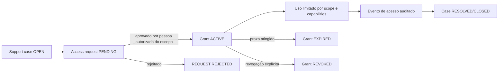
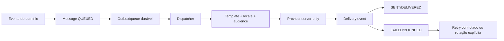

# SDD — Fase 3B-R: sessões isoladas e comunicação transacional

## Status e decisão de governança

**SDD APROVADA PARA IMPLEMENTAÇÃO CONTROLADA — ADENDO 3B-R APROVADO — FASES 3B-R2a E 3B-R4a ATIVAS LOCALMENTE**

Módulo proprietário: Interface Planner / infraestrutura compartilhada.

Esta SDD registra o estado observado no checkout em 2026-08-09 e separa o
que já está implementado localmente do que ainda exige decisão, testes e
homologação. O adendo abaixo autoriza somente implementação local das fatias
3B-R2a e 3B-R4a, incluindo migrations novas ainda não aplicadas, sem SQL
remoto, alteração remota de Auth, mudança remota de owner/membership,
configuração remota de provider ou deploy.

## Invariantes preservados

- A identidade operacional é `auth.users.id` / `auth.uid()`.
- A autorização de marca continua baseada em `marcas.owner_user_id` ou
  `brand_memberships.member_user_id` ativo com permissões explícitas.
- A autorização de agência continua baseada em `agencies.owner_user_id` ou
  `agency_memberships.user_id` ativo.
- Ser Admin global não concede owner, membership de agência nem acesso
  editorial implícito.
- `localStorage`, IndexedDB e preferências de navegação não são fonte de
  autorização.
- Convite é temporário; acesso permanente ocorre por login normal.
- Nenhuma mudança nesta fase deve alterar marcas, owners, memberships,
  `perfis.role`, RLS ou dados editoriais.

Observação de contrato: o checkout atual e as migrations canônicas usam
`agency_memberships.user_id`; `member_user_id` é o campo canônico observado
em `brand_memberships`. Esta fase não renomeia nem cria uma coluna concorrente.

## Auditoria local de consumidores

| Área | Evidência encontrada | Classificação | Consequência |
| --- | --- | --- | --- |
| Sessão browser | `components/auth/supabase-session-context.tsx` usa o cliente Supabase SSR, `getSession()` e `onAuthStateChange()` | CANONICAL | É a fonte de identidade do cliente atual |
| Sessão server | `lib/server/supabase-session.ts`, `lib/supabase/server-client.ts` e `auth.getUser()` | CANONICAL | Guards devem continuar verificando o ator no servidor |
| Refresh de cookies | `proxy.ts` e `lib/supabase/session-proxy.ts` | CANONICAL | Atualiza sessão; não deve decidir tenant |
| OAuth/PKCE | `app/auth/callback/route.ts` usa `exchangeCodeForSession(code)` | CANONICAL | Permanece somente para fluxos com `code` e verifier compatíveis |
| Links administrativos | `app/auth/confirm/route.ts` usa `verifyOtp({ token_hash, type })` | CANONICAL | Não deve ser confundido com PKCE |
| Sign-out | `SupabaseSessionProvider.signOut()` chama `auth.signOut()` e navega para `/login` | CANONICAL / INCOMPLETE | Não há ainda uma barreira comum de geração que invalide todas as respostas em voo |
| Contextos | `/api/contexts` e `ProductShell` usam `cache: "no-store"`; layouts de agência/marca são `force-dynamic` | CANONICAL | A revalidação server-side está presente |
| BrandProvider | Limpa marcas, papel e seleção quando o estado da sessão muda | CANONICAL / INCOMPLETE | A limpeza depende do ciclo React e não cobre todo estado editorial compartilhado |
| Estado editorial em memória | `EditorialPipelineProvider` indexa `workspaces` e `snapshots` somente por `brandId` | CROSS_ACTOR_CACHE_RISK | A e B no mesmo perfil podem observar estado anterior antes da reconciliação remota |
| Recuperação editorial local | Várias chaves usam somente `brandId` e documento; algumas preferências do Minerador usam `userId + brandId` | STALE_STATE_RISK | Não pode autorizar nem ser exibida como estado remoto confirmado; não deve ser apagada automaticamente |
| Requests client-side | Existem guards de geração/abort local em partes do código, mas não uma época comum por ator | CROSS_ACTOR_CACHE_RISK | A implementação precisa descartar resultados antigos após logout/troca |
| NextAuth | Nenhuma dependência, rota `/api/auth/[...nextauth]` ou consumidor runtime foi encontrado no código atual | SAFE_TO_REMOVE / DOC_STALE | Documentos antigos ainda descrevem coexistência; a documentação deve ser corrigida somente como estado observado |
| `ADMIN_EMAIL` | Não foi encontrado como consumidor runtime nos diretórios ativos; aparece em testes/documentos históricos | SAFE_TO_REMOVE / DOC_STALE | Não usar como fallback; confirmar novamente antes de declarar zero legado |
| Acesso temporário | `generate_temporary_access`, `temporaryAccessLink` e “Gerar acesso temporário” permanecem em API e painel Admin | LEGACY_ACTIVE | Deve sair em corte próprio, com regressão de acesso normal |
| Recuperação manual | `generate_password_recovery` e envio de recuperação permanecem | CANONICAL AUTH FLOW / REVIEW_REQUIRED | Recuperação não é login administrativo; revisar a UX sem transformá-la em acesso temporário |
| Comunicação | `CommunicationService` resolve configuração/Vault e envia diretamente pelo provider | CANONICAL BOUNDARY / INCOMPLETE | Ainda não existe outbox durável, tabela de mensagens, eventos de entrega, dispatcher ou retry persistente |
| Convites | Onboarding e links Auth existem, com estados server-side e token bruto apenas no fluxo de entrega imediata | CANONICAL / INCOMPLETE | Mensagem criada e entrega confirmada ainda são estados distintos |

## Diagnóstico sanitizado por identidade

O diagnóstico remoto futuro deve receber a identidade somente por parâmetro
operacional controlado e retornar apenas:

```text
identity_exists: YES | NO | INPUT_REQUIRED
email_confirmed: YES | NO | UNKNOWN
password_provider_present: YES | NO | UNKNOWN
account_disabled: YES | NO | UNKNOWN
current_session_valid: MANUAL_ONLY
global_role: ADMIN | STANDARD | NONE | UNKNOWN
agency_access_count: N
brand_owner_count: N
brand_active_membership_count: N
brand_access_source: OWNER | ACTIVE_MEMBERSHIP | NONE | MULTIPLE_LEGITIMATE_SOURCES | REVIEW_REQUIRED
```

O diagnóstico não pode retornar e-mail, UUID, token, segredo, claims
completas ou conteúdo editorial. A validade da sessão deve ser comprovada
por login/SSR em smoke manual; ela não é inferível somente de uma tabela.

## Regra final de troca de identidade

### Sequencial no mesmo slot

```text
A login → contexts(A) → logout → B login → contexts(B)
```

O resultado de B deve depender somente da sessão SSR de B. A implementação
futura deverá:

1. encerrar a sessão Supabase do slot atual;
2. invalidar a época/ator de todas as requests client-side;
3. limpar estado de autorização, seleção e shell dependente da identidade;
4. impedir que uma resposta de A reidrate React state depois do logout;
5. preservar apenas recuperação editorial local não autorizativa, sem
   exibi-la como dado confirmado de B;
6. redirecionar para `/login` com destino interno sanitizado.

Não usar cookie próprio de identidade, JWT paralelo, query-string de sessão,
localStorage ou IndexedDB como fonte de verdade.

### Simultânea em abas

O mesmo origin compartilha os cookies Supabase e não pode representar duas
identidades independentes com segurança. O contrato proposto é isolamento
por slot de host:

```text
local:    http://s-a1.localhost:3000
futuro:   https://s-a1.app.mineradorkey.com
```

O slot é somente um namespace de sessão. Não é tenant, não concede acesso e
não substitui `auth.uid()`. Os cookies devem ser host-only, sem `Domain`
compartilhado. O proxy poderá preservar as rotas canônicas existentes após
resolver o slot; links internos precisam permanecer no mesmo host.

Essa parte exige SDD de implementação do proxy/host, testes de browser e
revisão de deploy. Não está implementada nesta etapa.

## Comunicação transacional proposta

A fronteira existente `CommunicationService` será preservada. A evolução
estrutural futura deverá separar:

```text
evento de negócio
→ mensagem persistida
→ outbox/queue durável
→ template versionado
→ provider
→ eventos de entrega
→ histórico e retry controlado
```

Entidades propostas, sujeitas a migration própria e revisão humana:

- `communication_templates`;
- `communication_messages`;
- `communication_delivery_events`.

Estados de mensagem: `QUEUED`, `SENDING`, `SENT`, `DELIVERED`, `FAILED`,
`BOUNCED`. O payload não deve conter senha, token bruto ou segredo. Para
links Auth, o dispatcher deve gerar/confirmar o link no último momento e
registrar somente a referência sanitizada da operação. Retry de link
temporário exige rotação explícita, não reenvio cego.

O provider global continua server-only e o Vault continua sendo a fonte da
credencial. `NOT_CONFIGURED`, falha do provider e entrega confirmada não
podem ser tratados como o mesmo estado.

## Fluxos que não podem permanecer no estado final

Após a aprovação do corte específico, remover do runtime e da UI:

- acesso temporário gerado pelo Admin;
- login mágico administrativo usado como mecanismo de acesso permanente;
- login provisório/impersonação;
- criação de senha pelo Admin;
- botão de copiar credencial Auth.

O login normal, a recuperação de senha iniciada pelo usuário/Admin dentro do
contrato oficial e o convite de uso único são fluxos diferentes e precisam de
testes próprios. Nenhuma remoção foi feita nesta auditoria.

## Plano de implementação em gates

1. **Auditoria e SDD:** aprovar esta proposta e resolver o risco de estado
   editorial indexado apenas por marca.
2. **Sessão sequencial:** implementar época por ator, limpeza de estado de
   autorização e regressão A→logout→B.
3. **Slots:** criar SDD específica de host/proxy, validar em browser e só
   então implementar o isolamento simultâneo.
4. **Comunicação:** especificar schema sucessor, idempotência, dispatcher,
   retry, retenção e rollback; não alterar `0019` nesta etapa.
5. **Corte de temporários:** remover UI/API após os fluxos normais estarem
   homologados.
6. **Homologação:** executar smoke sequencial, smoke multi-slot e smoke de
   entrega/aceite. Só depois declarar Auth e comunicação homologados.

## Rollback e proteção operacional

- Antes de qualquer migration futura: snapshot aprovado, revisão humana e
  rollback testado em ambiente autorizado.
- Em falha da sessão sequencial: manter o provider Supabase atual e restaurar
  somente o comportamento local de renderização, sem reativar fallback por
  marca, e-mail ou `ADMIN_EMAIL`.
- Em falha de comunicação: deixar a mensagem em estado não confirmado,
  manter o convite pendente quando aplicável e não criar agency/membership
  por causa de uma tentativa de entrega.
- Nenhum rollback deve apagar `localStorage`, IndexedDB, owners,
  memberships ou dados editoriais automaticamente.

## Aceite e estado atual

```text
local_auth_source: SUPABASE_SSR
sequential_identity_isolation: IMPLEMENTED_LOCALLY_PENDING_MANUAL_SMOKE
simultaneous_session_slots: IMPLEMENTED_LOCALLY_PENDING_MANUAL_SMOKE
editorial_cross_actor_cache_risk: MITIGATED_LOCALLY
communication_service_boundary: PRESENT
durable_outbox: NOT_IMPLEMENTED
delivery_events: NOT_IMPLEMENTED
temporary_admin_access: LEGACY_ACTIVE
auth_and_communication_homologation: BLOCKED
schema_change_required_now: NO
remote_operations: NONE

### Implementação controlada 3B-R1 — estado local

Implementado no checkout, sem alteração de schema, Auth remoto, owners,
memberships, RLS, providers ou dados:

- `SupabaseSessionProvider` expõe `actorUserId` e `sessionEpoch`; logout e
  troca de ator invalidam o estado de identidade antes da navegação.
- `EditorialPipelineProvider` mantém workspaces e snapshots por ator e marca,
  e descarta respostas de inteligência/workspace que pertençam a uma época
  anterior.
- recuperações locais de pipeline, Arquiteto, Redator, BrandDNA e
  Site/Sitemap passaram a usar chaves com `actorUserId`; chaves antigas não
  são apagadas nem usadas como fonte de identidade.
- `/auth/new-slot` cria um host de sessão novo, com destino interno
  sanitizado; o slot não carrega identidade, tenant, token ou autorização.
- `ProductShell` oferece `Entrar em outra conta`, preservando a rota no novo
  host. O cliente browser Supabase continua sem configuração `Domain`,
  preservando cookies host-only.

Ainda pendente: smoke manual com duas identidades, confirmação de DNS/hosts de
produção quando `SESSION_SLOT_ROOT_DOMAIN` for configurado e validação visual
de logout independente. A homologação não é declarada por testes locais.
```

### Validações desta preparação

- auditoria estática de consumidores de sessão, contexto, cache, NextAuth,
  `ADMIN_EMAIL` e comunicação: concluída localmente;
- alteração de código runtime: não realizada;
- migration, SQL remoto, Auth/provider, owners/memberships e dados: não
  alterados;
- smoke de duas identidades e multi-slot: pendente de implementação e
  validação manual;
- build, TypeScript e suíte completa: não foram repetidos porque esta etapa
  alterou somente documentação e não alterou runtime.

## Adendo — Admin global, suporte, notificações e observabilidade

### Fronteira definitiva do Admin global

O Admin global administra e monitora a plataforma. O papel global não
concede:

- acesso operacional a uma agência;
- acesso editorial a uma marca;
- configuração pertencente a uma agência ou marca;
- owner, membership ou permissão editorial;
- impersonação ou sessão em nome de outra pessoa.

O Admin atua sempre com seu próprio `actorUserId`. Para investigar um
workspace, precisa de um `support_access_grant` explícito, limitado ao
escopo, às capabilities e ao período aprovado. Sem grant, pode consultar
somente metadados de plataforma permitidos, como estado de entrega, métricas
agregadas, configuração sanitizada e eventos de auditoria sem conteúdo.

### Auditoria de estruturas existentes

| Estrutura/contrato | Situação observada no checkout | Consumidores ativos encontrados | Decisão |
| --- | --- | --- | --- |
| `delegated_access_grants` | Existe na migration editorial `0002`, com `marca_id`, `grantee_user_key`, status e expiração | Não foram encontrados consumidores ativos em `app`, `lib` ou `modules` | HISTÓRICO/LEGADO; não reutilizar como suporte sem migração canônica por UUID |
| `delegated_access_permissions` | Existe junto do grant legado | Não foram encontrados consumidores ativos | HISTÓRICO/LEGADO; não duplicar nem assumir que atende capabilities de suporte |
| `provider_usage_events` | Aparece em documentação de arquitetura de providers | Nenhuma tabela, migration ou consumidor runtime encontrado | PROPOSTA; definir em migration sucessora própria |
| `brand_invitations` | Existe na migration `0002`, com `token_hash`, papel e permissões de marca | `lib/server/editorial-repositories.ts` e fluxo editorial | CONVITE DE MARCA; não é grant de suporte |
| `agency_applications` | Existe na migration `0018` | Onboarding público e Admin | SOLICITAÇÃO DE AGÊNCIA; não é identidade nem membership |
| `agency_invitations` | Existe na migration `0018`, com hash, expiração, origem e aceite | Onboarding e Admin de agências | CONVITE DE AGÊNCIA; não é grant de suporte |
| `platform_communication_config` | Existe na migration `0019`, com referência ao Vault e RPCs server-only | `CommunicationService` e painel Admin | CONFIGURAÇÃO GLOBAL; não é outbox nem histórico de entrega |
| Eventos editoriais | `editorial_decision_events`, `editorial_version_status_events` e `brand_site_events` existem | Repositórios editoriais | EVENTOS DE DOMÍNIO; não substituem auditoria de segurança/platform-wide |
| Auditoria transversal | Não foi encontrada entidade única de auditoria de sessões, suporte, comunicação ou notificações | Nenhum consumidor transversal encontrado | PROPOSTA; precisa de retenção, acesso e sanitização próprios |

Esta auditoria é local. A presença de uma migration no repositório não
comprova a existência do objeto no remoto; essa confirmação permanece
pendente de catálogo remoto autorizado.

### Modelo futuro de suporte

As entidades propostas são distintas de owner, membership, convite e do
grant legado:

- `support_cases`: caso, assunto sanitizado, status, prioridade, abertura,
  fechamento e referência opcional ao objeto de origem;
- `support_case_messages`: mensagens do caso, autor canônico, corpo com
  política de retenção, anexos por referência segura e timestamps;
- `support_access_requests`: pedido de acesso, escopo, solicitante,
  justificativa, capabilities desejadas, decisão e auditoria;
- `support_access_grants`: autorização efetiva, com os campos abaixo;
- `support_access_events`: trilha append-only de pedido, aprovação, uso,
  revogação, expiração e tentativa bloqueada.

Contrato mínimo de `support_access_grants`:

```text
id
scope_type: PLATFORM | AGENCY | BRAND
scope_id: referência do escopo, nula somente para PLATFORM
requested_by: auth.users.id
approved_by: auth.users.id
granted_to: auth.users.id
reason: justificativa obrigatória
capabilities: allowlist explícita e mínima
access_mode: READ_ONLY | ACTIONS_EXPLICIT
starts_at
expires_at: obrigatório para TEMPORARY, opcional para UNTIL_REVOKED
duration_type: TEMPORARY | UNTIL_REVOKED
status: REQUESTED | ACTIVE | EXPIRED | REVOKED | REJECTED
revoked_at
created_at / updated_at
```

`scope_id` nunca substitui a checagem canônica de `auth.uid()`. Uma
capability não pode conceder acesso a segredo, token bruto, senha, Vault ou
conteúdo fora do escopo. O modo padrão é `READ_ONLY`; ações precisam ser
allowlistadas e auditadas individualmente.

#### Lifecycle do suporte e do grant



Regras:

- o Admin pode abrir ou acompanhar um caso conforme sua autorização de
  plataforma, mas não aprova sozinho acesso ao workspace;
- a aprovação deve vir de owner ou administrador autorizado do escopo;
- o próprio Admin é o `granted_to` quando precisar acessar o workspace;
- nenhum grant cria ou altera membership, owner, papel global ou convite;
- toda leitura/escrita coberta pelo grant gera evento sanitizado;
- revogação é imediata; expiração é obrigatória para `TEMPORARY`;
- `UNTIL_REVOKED` exige revogação explícita e continua auditável;
- não existe impersonação: a sessão e o ator continuam sendo do Admin.

### Matriz de autorização proposta

| Ação | Admin sem grant | Admin com grant ativo | Owner/admin do escopo | Membro comum |
| --- | --- | --- | --- | --- |
| Ver métricas agregadas da plataforma | ALLOW | ALLOW | ALLOW | DENY |
| Ver conteúdo editorial do escopo | DENY | ALLOW, conforme capability | ALLOW, conforme permissão | conforme membership |
| Abrir caso de suporte | ALLOW | ALLOW | ALLOW | ALLOW, conforme produto |
| Aprovar acesso de suporte ao escopo | DENY | DENY, salvo escopo autorizado distinto | ALLOW | DENY |
| Revogar grant do próprio escopo | DENY | DENY, salvo capability específica | ALLOW | DENY |
| Acessar segredo/Vault/token/senha | DENY | DENY | DENY | DENY |
| Impersonar outra identidade | DENY | DENY | DENY | DENY |
| Alterar owner/membership | DENY | DENY, salvo rota administrativa própria | conforme contrato existente | conforme contrato existente |

### Notificações internas e preferências

Entidades futuras:

- `notifications`: evento/notificação semântica, categoria, objeto de origem,
  prioridade, payload sanitizado e timestamps;
- `notification_recipients`: destinatário por `auth.users.id`, estado
  individual e os campos `delivered_at`, `seen_at`, `read_at`,
  `acknowledged_at` e `clicked_at`;
- `notification_preferences`: preferências por ator, categoria, canal e
  frequência, sem poder desativar notificações obrigatórias de segurança.

Categorias:

```text
SECURITY, ACCOUNT, ACCESS, SUPPORT, INVITATION, WORKFLOW,
PUBLICATION, USAGE, BILLING, SYSTEM, ANNOUNCEMENT
```

Obrigatórias, independentemente da preferência: `SECURITY`, revogação ou
expiração de acesso, mudança de papel/permissão, recuperação de conta,
falha de segurança e confirmação de aceite relevante. As demais podem
respeitar preferência, subject to retenção e regras do produto.

Notificação não é thread. Respostas ficam em `support_case_messages` ou no
objeto de origem. O payload não deve carregar segredo, token bruto ou corpo
editorial desnecessário.

#### Lifecycle da notificação

```text
CREATED → DELIVERED → SEEN → READ → ACKNOWLEDGED
                         ↘ CLICKED
```

Os timestamps são independentes: clicar não implica leitura, e leitura não
implica acknowledgement. Uma notificação pode expirar sem apagar o evento
de origem.

### Comunicação, outbox e mensagens

Devem permanecer separados:

```text
evento de domínio
≠ notificação in-app
≠ communication_message
≠ delivery_event
≠ convite
≠ membership
```

O desenho futuro da comunicação é:



`communication_messages` deve conter tipo, template/version, locale,
destinatário, referências opcionais de agência/marca/ator, provider, status,
tentativas, idempotency key, provider message id, timestamps e erro
sanitizado. `communication_delivery_events` é append-only. O outbox nunca
persiste senha, segredo ou token bruto; para Auth links, persiste somente a
referência da operação e gera o material sensível no último momento, em
server-side.

Falha de provider nunca vira sucesso. Convite criado não significa mensagem
entregue. Retry de convite ou link de recuperação exige idempotência e
rotação explícita.

### Observabilidade da plataforma

O modelo futuro deve registrar metadados sanitizados para:

- sessões: slot, evento, resultado, duração e erro categorizado;
- atividade por módulo: módulo, ação, escopo e resultado;
- providers: provider, operação, status, latência, tentativas e custo;
- tokens: somente tipo, operação, criação/rotação/consumo/expiração, nunca o
  valor bruto;
- custos: unidade, quantidade, moeda e origem do cálculo;
- erros: código estável, etapa e correlação sem segredo;
- convites: ciclo de estado e delivery separado;
- notificações: ciclo individual e canal;
- suporte: pedido, grant, uso, revogação e bloqueios.

O Admin pode consultar métricas agregadas e metadados sem conteúdo
editorial. Conteúdo só fica disponível durante um `support_access_grant`
ativo e dentro das capabilities aprovadas. Logs devem aplicar retenção,
minimização e controle de acesso; não podem registrar token, cookie, senha,
service role, e-mail completo quando não necessário ou conteúdo editorial
fora do escopo.

### Audiências e comunicados

O contrato futuro deve aceitar uma audiência explícita:

```text
PERSON
AGENCY
AGENCY_GROUP
BRAND
PLATFORM
```

O objeto de audiência deve ser resolvido server-side, com deduplicação,
idempotência e exclusão de destinatários sem autorização. Não implementar
envio em massa nesta rodada. Um comunicado de plataforma não concede acesso
ao conteúdo nem altera permissões.

### Mapa de rotas

#### Rotas existentes preservadas

| Rota | Contrato atual |
| --- | --- |
| `/admin` e `/admin?tab=...` | administração global; não concede workspace |
| `/admin/agencias` | applications, invitations e agências, conforme papel global |
| `/admin?tab=configuracoes` | configuração global de comunicação sanitizada |
| `/login` / `/cadastro` / `/recuperar-senha` | Auth canônico e destinos internos |
| `/onboarding/agencia` | convite temporário e aceite autenticado |
| `/agencias/{agencyRef}` | workspace de agência, owner/membership verificados |
| `/{brandRef}/...` | workspace editorial, owner/membership/permissão verificados |

#### Rotas futuras propostas, não implementadas

```text
/admin/suporte
/admin/notificacoes
/admin/comunicacao
/admin/observabilidade
/agencias/{agencyRef}/suporte
/{brandRef}/suporte
```

Essas rotas devem usar o shell e os guards atuais, sem criar fallback local.
O conteúdo de workspace nunca deve ser servido pela rota administrativa sem
grant explícito.

### Plano de migrations futuras

Nenhuma migration é criada nesta rodada. Após SDD específica, snapshot e
revisão humana, a ordem proposta é:

1. migration de suporte e grants canônicos por UUID, incluindo constraints,
   capabilities allowlistadas, lifecycle e eventos append-only;
2. migration de notificações e preferências, com destinatários e estados
   individuais;
3. migration de mensagens, outbox e delivery events, com idempotência,
   retry e retenção;
4. migration de observabilidade e `provider_usage_events`, caso o inventário
   confirmado justifique persistência própria;
5. remoção ou isolamento explícito dos contratos legados somente após prova
   de consumidores zero, snapshot e rollback.

Os nomes/numerações dessas migrations ficam deliberadamente em aberto até a
revisão do schema remoto. Não reutilizar `delegated_access_grants` sem uma
decisão de compatibilidade e backfill por UUID.

### Fases 3B-R1 a 3B-R5

| Fase | Entrega | Gate de saída |
| --- | --- | --- |
| 3B-R1 | sessões sequenciais isoladas por ator e fundação local de slots host-only | regressões locais aprovadas; smoke manual A → logout → B e multi-slot pendentes |
| 3B-R2 | notificações e comunicação transacional | evento, mensagem, outbox e entrega separados; sem alteração nesta rodada |
| 3B-R3 | suporte e grants auditados | grant explícito, expiração, revogação e auditoria; sem alteração nesta rodada |
| 3B-R4 | suporte, notificações e observabilidade | migrations aplicadas manualmente, RLS/grants validados, trilha de auditoria comprovada |
| 3B-R5 | outbox, dispatcher, providers, corte de temporários e homologação | entrega real diferenciada de criação; retries/idempotência; smoke completo aprovado |

### Riscos e dependências

- **Estado editorial compartilhado por marca:** risco de exposição visual entre
  atores; depende de namespace por ator ou reset seguro antes do corte.
- **Cookies same-origin:** impedem múltiplas identidades simultâneas sem slots;
  depende de proxy, DNS, ambiente local e deploy.
- **Grant legado por `user_key`:** não atende o contrato UUID de suporte;
  depende de inventário remoto e decisão de migração.
- **Comunicação sem outbox:** envio direto pode perder histórico e retry;
  depende de schema sucessor, worker/dispatcher e provider real.
- **Notificações sem destinatário canônico:** preferências podem vazar ou
  silenciar segurança; depende de RLS e estados por ator.
- **Observabilidade sensível:** logs podem expor tokens ou conteúdo;
  depende de sanitização, retenção e revisão de grants.
- **Admin sem acesso operacional:** exige UX explícita de “acesso não
  disponível” e fluxo de solicitação/aprovação, sem fallback.

### Rollback específico

- Antes de cada migration: snapshot/backup aprovado, preflight, revisão
  humana e rollback testado.
- Falha em suporte: desabilitar novos grants e manter casos em modo
  somente leitura; não alterar memberships ou owners.
- Falha em notificações: preservar o evento de origem e marcar a entrega como
  não confirmada; não repetir indefinidamente.
- Falha em outbox/provider: pausar dispatcher, manter mensagens `FAILED` ou
  `QUEUED`, rotacionar links quando necessário e não afirmar envio.
- Falha em slots: retirar somente o roteamento de slots, preservando a sessão
  host-only do slot original; nunca compartilhar cookies entre hosts.
- Nenhum rollback pode apagar conteúdo editorial, storage local, tokens de
  recuperação ainda válidos, owners ou memberships automaticamente.

### Testes e smoke propostos

#### Testes automatizados

- Admin sem grant recebe `403` para workspace de agência/marca;
- grant somente dentro de `scope_id` e capabilities aprovadas;
- grant expirado/revogado bloqueia imediatamente;
- owner/membership não são criados ou alterados por grant;
- impersonação e acesso a Vault/token/senha sempre falham;
- notificações obrigatórias ignoram preferência de silêncio;
- `read_at` não marca `acknowledged_at` automaticamente;
- mensagem criada, enfileirada, enviada e entregue são estados distintos;
- retry respeita idempotency key e rotação de Auth links;
- nenhum segredo/token bruto aparece em payload, log ou delivery event;
- A→logout→B não preserva workspace/cache de A;
- slots diferentes isolam cookies, contextos, shell e logout;
- `delegated_access_grants` legado não é consultado como grant de suporte.

#### Smoke manual futuro

```text
Slot A: Admin entra → vê métricas da plataforma → workspace negado
Slot A: solicita suporte para uma agência
Slot B: owner/admin da agência aprova grant read-only temporário
Slot A: abre somente o escopo aprovado → banner visível → evento auditado
Slot B: revoga grant → Slot A perde acesso sem logout da própria sessão
Slot C: outra identidade permanece ativa em outro slot
Slot A: logout → nenhuma sessão de B/C é afetada
Comunicação: evento → queued → delivery confirmada ou failed explícita
Notificação: criada → entregue → vista → lida → acknowledged/clicked
```

Não usar conteúdo editorial real, segredo ou token real no smoke de
desenvolvimento. O smoke remoto exige ambiente autorizado, identidades de
teste e revisão de retenção.

### Critérios de aceite da expansão documental

```text
global_admin_boundary: DOCUMENTED
support_grant_separate_from_membership: DOCUMENTED
legacy_grants_audited: DOCUMENTED
notifications_model: DOCUMENTED
communication_outbox_model: DOCUMENTED
observability_model: DOCUMENTED
slot_session_model: DOCUMENTED
entity_diagrams: DOCUMENTED
authorization_matrix: DOCUMENTED
lifecycles: DOCUMENTED
future_migration_order: DOCUMENTED
implementation_phases: DOCUMENTED + LOCAL_CONTROLLED
runtime_implementation: 3B-R1_LOCAL_ONLY + 3B-R2a_R4a_LOCAL_ONLY
migration_created: 0020_communication_transactional_minimum.sql_LOCAL_ONLY
remote_operations: NONE
```

## Adendo aprovado — resequenciamento 3B-R2a + 3B-R4a

### Status e autorização

**Status do adendo: APROVADO PARA IMPLEMENTAÇÃO LOCAL CONTROLADA**

Autorização registrada conforme decisão do usuário recebida nesta tarefa.
Este adendo autoriza somente as fatias 3B-R2a — comunicação transacional
mínima — e 3B-R4a — convite/onboarding mínimo necessário para acesso.

Não autoriza sino, notificações internas, preferências, suporte, grants,
observabilidade avançada, alteração dos módulos editoriais, operação remota,
commit, push ou deploy.

### Recuperação de senha

O contrato preferencial é:

```text
usuário → /recuperar-senha → Supabase Auth → nova senha definida pelo usuário
```

O Admin não cria senha, não conhece senha e não recebe token de recovery. Ele
pode apenas orientar ou iniciar uma solicitação que continua pertencendo à
identidade do usuário.

O recovery administrativo existente é consumidor a auditar. A implementação
futura deverá decidir explicitamente se ele será preservado, adaptado ou
removido. Não ficam aprovados dois mecanismos de senha apenas por legado.

### Usuário existente e usuário novo

Dentro de um `AgencyInvitation` válido, a decisão ocorre server-side:

```text
sem identidade Auth → conclusão de cadastro
com identidade Auth → login normal
ambos → mesmo convite → aceite autenticado → onboarding
```

Não haverá endpoint público de enumeração, exposição da existência de conta ou
decisão baseada no erro de `generateLink(signup)`.

### Semântica de Agência ativa

`agencies.status = 'active'` não é prova isolada de acesso operacional.
Para fluxos novos, a prontidão exige Agência existente, `owner_user_id`
válido e onboarding/aceite correspondente. A interface poderá separar
conceitualmente:

```text
Agência: ACTIVE
Acesso: READY | PENDING | REQUIRES_ATTENTION
```

Esses nomes não autorizam novos enums persistentes sem revisão. Registros
legados não serão alterados, desativados ou submetidos a onboarding retroativo
automaticamente.

### Outbox/fila mínima

Permanecem obrigatórios mensagem persistida, queue/outbox durável, dispatcher,
retry e delivery events. Não é obrigatório criar tabelas físicas separadas
para mensagens, outbox e fila. `communication_messages` poderá representar a
fila com status, agendamento, tentativas, claim/lock, identificador do
provider e erro sanitizado. Entidade adicional só será criada se houver
necessidade técnica demonstrada.

### Sequenciamento aprovado

```text
3B-R2a comunicação transacional mínima
→ 3B-R4a convite/onboarding mínimo
→ recuperação de senha validada
→ smoke real de onboarding
→ retorno ao smoke da 3B-R1
→ continuação da 3B-R2
→ 3B-R3
```

### Estado de implementação

```text
adendo_status: APPROVED_LOCAL_IMPLEMENTATION
implementation_scope: 3B-R2a + 3B-R4a
local_implementation: COMPLETED_FOR_SCOPED_RUNTIME
local_migration_created: 0020_communication_transactional_minimum.sql
remote_operations: NONE
remote_migration: PENDING_MANUAL_OPERATION
provider_configuration: PENDING_MANUAL_OPERATION
real_delivery: PENDING_MANUAL_OPERATION
3B-R1_homologation: BLOCKED
```

Decisão de implementação local sobre recovery: o consumidor administrativo
de acesso temporário/recovery foi removido do runtime. Permanece somente o
recovery pessoal do usuário em `/recuperar-senha`.
# Nota de estado vigente — 2026-08-09

As tabelas e contratos históricos abaixo descrevem o diagnóstico anterior. O
adendo aprovado e a seção de implementação local ao final são a referência
vigente para 3B-R2a/3B-R4a: fila durável sem token bruto para o Admin,
recovery pessoal e migration 0020 ainda não aplicada.
# Correcao vigente do gate local - 3B-R2a/R4a - 2026-08-09

Esta secao complementa a implementacao local anterior e prevalece sobre a
descricao historica de invalidacao de token por retry.

- **Token:** `agency_invitation_token_generations` guarda somente hashes,
  validade, uso e revogacao. Cada tentativa de entrega cria uma geracao sem
  substituir as anteriores; o aceite valida qualquer geracao valida e marca
  todas como usadas na mesma transacao. Nenhum token bruto e persistido.
- **Lease:** `claim_communication_message` usa lease estavel de 300 segundos,
  `FOR UPDATE SKIP LOCKED`, reclaim apenas de `SENDING` expirado e maximo de
  tres tentativas. O fechamento limpa o lease em sucesso e falha e preserva
  `provider_message_id` ja conhecido.
- **Rollback:** `fase-comunicacao-0020-rollback-dry-run-read-only.sql` somente
  informa objetos, contagens e estado. O rollback de schema exige snapshot e
  bloqueia quando ha templates, mensagens, eventos ou geracoes; o rollback
  operacional e parar dispatcher/config e nao apagar dados de negocio.
- **Classificacao:** correcao verificada apenas no checkout local. Migration
  0020, provider, Vault, webhook, delivery real, catalogo remoto e smoke
  continuam pendentes; operacoes remotas permanecem `NONE`.
# Gate remoto pós-migration 0020 - 2026-08-09

snapshot_pre_0020: NOT_PERFORMED
migration_0020: APPLIED_MANUALLY
migration_result: SUCCESS_REPORTED_BY_USER
remote_schema_verification: INCOMPLETE

O retorno `Success. No rows returned` foi relatado pelo usuário e não foi
tratado como prova de catálogo. Antes de qualquer provider, Vault, dispatcher
ou mensagem real, deve ser executado o script read-only
`supabase/scripts/fase-comunicacao-0020-post-verification-read-only.sql` e
deve ser feito snapshot pós-0020. Nenhuma operação remota foi executada pelo
agente.

## Homologacao manual 3B-R1 e preparacao 3B-R2a - 2026-08-10

Conforme evidencia manual relatada pelo usuario, a 3B-R1 foi homologada em
navegador real com duas identidades simultaneas no mesmo perfil, hosts/slots,
Agencies e Brands distintos, refresh sem mistura, negacao de outra Agency e
logout de um slot preservando o outro.

```text
MULTI_SESSION_SMOKE = PASS
SESSION_ISOLATION = PASS
CONTEXT_ISOLATION = PASS
LOGOUT_ISOLATION = PASS
```

Na implementacao local 3B-R2a, o dispatcher de AgencyInvitation usa o helper
canonic `buildIsolatedAuthEntryUrl`, preserva o destino original no parametro
`next` e nao persiste URL final nem token bruto. Provider, Vault, webhook,
cron/worker, envio real e validacao de comunicacao continuam pendentes.
