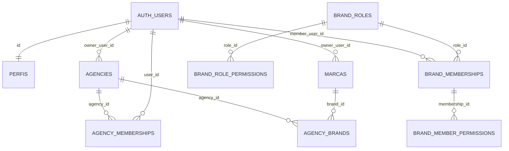

# SDD — geração canônica de identidade, acesso e tenantização

- **Status:** Aprovada para implementação controlada e aplicação manual da 0015, após os gates remotos registrados na auditoria da Fase 0. A execução remota é exclusivamente do usuário; não autoriza operação remota autônoma do agente.
- **Módulo proprietário:** Arquitetura compartilhada / Auth / Admin / Agências / Marcas
- **Data:** 2026-08-06
- **Escopo:** identidade, sessão, autorização, Admin global, agências, marcas, memberships, papéis, RLS, rotas e consumidores compartilhados. As conexões, grants, bindings e consumo de integrações são definidos separadamente em `sdd-arquitetura-integracoes-plataforma-agencia-marca.md`.

## 1. Decisão

O estado final terá uma única arquitetura operacional:

- `auth.users.id` é a única identidade técnica de pessoas;
- Supabase Auth com `@supabase/ssr` é a única sessão;
- `perfis.role` é a única fonte do papel global (`admin` ou `user`);
- `marcas.id` é o único tenant editorial;
- `marcas.owner_user_id` é a única fonte de ownership;
- `brand_memberships.member_user_id` representa somente colaboradores explícitos;
- `Agency`, `AgencyMembership` e `AgencyBrand` são os conceitos canônicos de operação entre plataforma, agência e marca; a implementação local `0014` ainda requer homologação de catálogo, RLS, grants e dados;
- `brandRef = slug--brandId` é a única referência de rota de marca.

E-mail permanece atributo de contato e login. Não é chave de autorização, tenant, ownership, membership, nem fallback. `owner_user_id` não resolve tenant, não substitui `brandId` e não seleciona marca; depois que a marca for resolvida por `brandRef`/`brandId`, é uma relação canônica válida para autorizar o owner. Membership ativa continua sendo a relação canônica de colaboradores. O produto não manterá compatibilidade de runtime após o corte final.

Migrations aplicadas, versões editoriais, proveniência, documentos, publicações e evidências históricas permanecem preservados. Eles não podem continuar como contratos de autorização ou de sessão atuais.

### Decisão de compatibilidade UUID

`brand_memberships.member_user_id` é a única coluna UUID canônica de collaborator. Ela já é a relação UUID instalada pelas migrations 0005/0006, pelos índices/FKs, pelas funções RLS e pelos consumidores ativos. A alternativa `brand_memberships.user_id` foi rejeitada: criaria duas identidades UUID concorrentes para a mesma pessoa e exigiria dupla leitura sem ganho semântico.

A migration 0015 não cria nem preenche `brand_memberships.user_id`. O backfill futuro mantém `member_user_id`; o corte migra somente os contratos textuais que ainda dependem de `user_key`, e-mail ou `grantee_user_key`. Depois da prova de uso zero, uma migration de limpeza remove `user_key`, seus índices/FKs/policies/funções dependentes e os campos textuais editoriais sucessores. `member_user_id` permanece no schema final.

## 2. Evidências e estado atual auditado

| Área | Estado encontrado | Classificação |
| --- | --- | --- |
| Identidade | UUID de `auth.users` já existe em `marcas.owner_user_id` e `brand_memberships.member_user_id`; ainda há chaves textuais por e-mail. | Compatibilidade temporária e perigosa |
| Sessão | NextAuth controla login, `SessionProvider`, `useSession`, JWT e token Supabase; SSR Supabase está preparado, mas não é a sessão consumida. | Legado ativo + infraestrutura canônica incompleta |
| Admin | `perfis.role` existe, mas `ADMIN_EMAIL` ainda concede privilégio em `lib/server/authz.ts` e bloqueia despromoção em `global-user-admin.ts`. | Perigoso |
| Marca | `marcas.id`, `owner_user_id` e `brandRef` estão corretos; `perfis.marca_id` e aliases ainda participam de caminhos de compatibilidade. | Parcialmente canônico |
| Membership de marca | A tabela contém `user_key`, `member_user_id`, `role` e papel `owner`; criação de marca ainda materializa membership owner. | Legado ativo |
| Papéis | `brand_roles.marca_id` mistura catálogo global e escopo de marca; há `owner` e `platform_admin`. | Legado ativo |
| Editorial | `0002` usa `user_key` em memberships, grants, views, estados e funções/policies. | Legado ativo de autorização |
| Agência | Os conceitos Agency, AgencyMembership e AgencyBrand são canônicos; `0014` contém fundação local com UUID em `agency_memberships.user_id`, mas catálogo, RLS, grants e dados remotos não foram homologados. | Risco não confirmado — fundação canônica não homologada |
| Rotas tenantizadas | `/{brandRef}/...` usa UUID da marca; layouts ainda aceitam UUID isolado e carregam sessão pelo helper NextAuth. | Parcialmente canônico |

As confirmações sobre efeitos remotos de `0005`/`0006` e a estrutura de agência existentes são históricas, registradas em documentação. Esta SDD não executou nem comprova nova leitura remota.

## 3. Inventário de consumidores e contratos a retirar

### 3.1 Sessão NextAuth

Consumidores de runtime mapeados:

- `app/api/auth/[...nextauth]/route.ts`: Credentials, Google, callbacks JWT/session e cookies NextAuth;
- `components/providers.tsx`: `SessionProvider`;
- `app/page.tsx`, `components/brand-context.tsx`, `components/product-shell.tsx` e `app/selecionar-marca/select-brand-client.tsx`;
- `modules/conta`, `modules/marca`, Minerador, Arquiteto, Radar, Planejador, Redator, Publicações e `components/editorial/operational-screen-shared.tsx`;
- `lib/server/authz.ts`, `lib/supabase/browser-authenticated-client.ts`, `lib/auth/supabase-token.ts` e tipos NextAuth;
- layouts Admin e tenant, todas as APIs que dependem de `requireSessionProfile`;
- `app/api/mine/route.ts`, que também depende do token Google guardado no JWT NextAuth;
- testes `auth-jwt-lifecycle`, `manual-auth-admin`, `supabase-ssr-session`, `run-all` e consumidores indiretos.

O pacote `next-auth`, tipos, variáveis `NEXTAUTH_URL`/`NEXTAUTH_SECRET`, rota, callbacks, cookies e testes só podem sair quando nenhum item acima continuar em runtime.

### 3.2 Infraestrutura Supabase SSR já preparada

| Artefato | Papel no corte |
| --- | --- |
| `lib/supabase/browser-client.ts` | Cliente browser único, com sessão nativa persistida por cookies. |
| `lib/supabase/server-client.ts` | Cliente SSR que usa `await cookies()` do Next.js 16. |
| `lib/supabase/session-proxy.ts` e `proxy.ts` | Atualização de cookies; nunca autorização definitiva. |
| `lib/server/supabase-session.ts` | Base para `auth.getUser()` server-side. |
| `app/auth/callback/route.ts` e `app/auth/signout/route.ts` | Callback PKCE e logout nativo; integrar somente no corte. |

O `proxy.ts` deve continuar limitado a refresh/redirects técnicos. Segundo a documentação local do Next.js 16, Proxy não substitui autorização nem deve fazer busca lenta; decisões finais ficam em layouts, handlers, Server Actions e RLS.

### 3.3 Identidade por e-mail ou texto

Contratos ativos a migrar:

- `brand_memberships.user_key` e os fallbacks de `authz.ts`/`tenant-context.ts`;
- `delegated_access_grants.grantee_user_key`;
- `editorial_saved_views.user_key`;
- `content_document_user_states.user_key`;
- `editorial_current_user_key()` e `editorial_has_permission()` de `0002`;
- campos textuais de ator em artefatos e eventos editoriais, que devem ganhar referências UUID para novas gravações sem apagar a proveniência histórica;
- `ADMIN_EMAIL` e toda decisão de privilégio por e-mail.

`brand_invitations.email` pode permanecer somente como endereço de entrega e vínculo de destinatário. A aceitação deve registrar o `auth.users.id` autenticado e criar a membership por UUID; e-mail não pode ser consultado como autorização posterior.

### 3.4 Owner duplicado e Admin automático

`0002`, `0005`, provisionamento de marca e funções SQL criaram ou aceitam membership com `role='owner'`. `0002` também materializa `platform_admin` para todo Admin global. Ambos conflitam com o contrato final:

- owner terá acesso diretamente por `marcas.owner_user_id`;
- Admin global só administra a plataforma;
- nenhum dos dois recebe `brand_membership` automaticamente.

Qualquer membership de owner ou `platform_admin` precisa ser classificada pelo snapshot: redundante e removível, ou vínculo editorial explícito que exige decisão humana. Nunca será removida apenas pelo e-mail, nome ou suposição de origem.

### 3.5 SQL, RLS e histórico

| Fonte | Contratos ativos a substituir |
| --- | --- |
| `0002_operational_editorial_flow.sql` | `user_key`, `editorial_current_user_key`, `editorial_has_permission`, `owner`, `platform_admin`, `marca_id` opcional em papéis, policies e triggers editoriais. |
| `0005_tenant_ownership_and_rls.sql` | `member_user_id`, `user_key`, role owner e triggers de último owner baseados em membership. Migrations permanecem históricas. |
| `0006_reconcile_tenant_security.sql` | Funções tenantizadas e policies em produção lógica que ainda citam `member_user_id`, `user_key` e owner em membership. |
| `0014_agency_foundation.sql` | Estrutura de agência aproveitável, mas papéis e policies devem convergir ao contrato final. |
| dry-runs, validações e rollbacks | Material histórico/operacional; não é removido antes de um substituto validado e de retenção definida. |

## 4. Modelo canônico final

### 4.1 Entidades e responsabilidade

| Entidade | Chave e responsabilidade final |
| --- | --- |
| `auth.users` | Identidade e credencial. Nunca substituída por e-mail. |
| `perfis` | `id = auth.users.id`; um perfil global por identidade, `role in ('admin','user')`. Não contém `marca_id`. |
| `marcas` | `id` é o tenant; `owner_user_id` é a única relação de owner; `status` controla disponibilidade. |
| `brand_memberships` | Colaboradores explícitos: `marca_id`, `member_user_id`, `role_id`, `status`, timestamps. Sem `user_key`, sem papel owner. `UNIQUE(marca_id,member_user_id)`. |
| `brand_roles` | Catálogo global de papéis: `admin_marca`, `editor`, `revisor`, `leitor`. Sem `marca_id`, sem `owner`, sem `platform_admin`. |
| `brand_role_permissions` | Permissões-base de cada papel global. |
| `brand_member_permissions` | Grants específicos de collaborator; nunca cria ownership. |
| `agencies` | Organização operacional canônica, com `id`, `owner_user_id`, `name`, `slug`, `status`, datas e capacidade de possuir conexões próprias e grants para marcas, conforme SDD de integrações. `owner_user_id` é o owner da agência e não depende de membership duplicada. |
| `agency_memberships` | Pessoas da agência: `agency_admin` ou `agency_member`; não concede acesso editorial por si só, mas pode autorizar administração das conexões e grants da própria agência. |
| `agency_brands` | Marcas administradas; índice parcial futuro/confirmado em catálogo garante no máximo uma agência `active` por marca. A troca preserva `brandId` e dados editoriais. |

`perfis` requer criação de linha mínima com `role='user'` para identidades novas, em mecanismo server-side/trigger revisado na migration sucessora. Esse mecanismo nunca pode conceder marca, agência, owner ou membership.

### Ciclo de `agency_memberships.canonical_role`

`canonical_role` é uma coluna de transição, criada pela 0015 porque a coluna atual `role` aceita `agency_admin`, `operator` e `viewer`. Sua origem é exclusivamente essa coluna atual: `agency_admin` permanece `agency_admin`; `operator` e `viewer` mapeiam para `agency_member`. Outros valores bloqueiam a transaction.

Durante a compatibilidade, os consumidores antigos (`agency-context`, `agency-admin` e Admin) continuam lendo `role`; os contratos novos preparados leem `canonical_role`. A duração termina no corte da aplicação, depois de paridade de dados, rotas e RLS. O nome definitivo no schema final é `agency_memberships.role`, com somente `agency_admin | agency_member`: uma migration posterior troca os consumidores para o campo final, amplia/migra a constraint de `role`, valida paridade e só então remove `canonical_role`. Nenhuma coluna de papel é removida na 0015.

`agencies.owner_user_id` não é derivado de `agency_admin`. Uma ou mais memberships podem identificar candidatos para revisão, mas o owner requer decisão humana UUID explícita. A 0015 aborta em zero, múltiplos ou mesmo único candidato ainda não aprovado; uma migration sucessora, após snapshot e decisão humana, será a única autorizada a atribuir o owner.

### 4.2 Autorização final

1. O servidor valida a sessão por `supabase.auth.getUser()`; nenhum cookie ou claim local é suficiente sozinho.
2. O Admin global é `perfis.role='admin'` para o UUID autenticado. Administra a estrutura da plataforma, não é owner, não é membro automático e não recebe acesso editorial normal de marca.
3. Um owner acessa integralmente somente quando `marcas.owner_user_id = auth.uid()`.
4. Um collaborator precisa de `brand_memberships.member_user_id = auth.uid()` e `status='active'`; suas permissões vêm do papel e de grants explícitos.
5. Agência controla sua estrutura, vínculos e integrações próprias/grants autorizados. Não habilita módulos editoriais da marca por si só.
6. Todo handler compara o `brandId` de body/registro com o contexto de rota já autorizado. Cache e seleção local são preferências, nunca autoridade.
7. RLS repete essas regras com `auth.uid()`. `anon` não acessa tabelas privadas; `service_role` fica exclusivamente em handlers administrativos server-side.

Suporte global futuro a uma marca exige mecanismo explícito, temporário, auditado e separado de `can_access_brand`, `can_manage_brand` e da autorização editorial normal.

### 4.3 Funções e policies sucessoras

As funções finais devem operar exclusivamente em UUID:

- `is_global_admin()` lê `perfis.id = auth.uid()` e `role='admin'`;
- `can_access_brand(uuid)` aceita somente owner da marca já resolvida ou `brand_memberships.member_user_id` ativo e autorizado;
- `can_manage_brand(uuid)` aceita owner, role `admin_marca` ou grant explícito `marca:manage`;
- `tenant_actor_has_permission(uuid,text,text)` usa somente owner da marca já resolvida, papel de membership ativa e grants UUID;
- `editorial_current_user_id()` retorna `auth.uid()`;
- `editorial_has_permission(uuid,text,text)` não lê `auth.jwt()->>'email'`, `user_key` ou `grantee_user_key`.

Policies, grants e triggers devem ser recriados contra as funções sucessoras antes da retirada dos objetos antigos. Qualquer função `SECURITY DEFINER` deve declarar `search_path` seguro e ter grants explícitos, preservando o endurecimento de 0006.

## 5. Rotas e contexts finais

| Superfície | Contrato final |
| --- | --- |
| Globais | `/`, `/login`, `/cadastro`, `/selecionar-marca`, `/admin`. |
| Marca | `/{brandRef}/`, `/{brandRef}/minerador`, `/arquiteto`, `/radar`, `/planejador`, `/redator`, `/publicacoes`, `/conta`. |
| Agência | `/agencias/{agencyRef}`, com `agencyRef = slug--agencyId`; rota ainda não existe e requer proposta de UI específica. |
| Login/cadastro/logout | `signInWithPassword`, `signUp`, `signOut` do cliente Supabase SSR. Cadastro cria só identidade/perfil global `user`. |
| Contextos | provider Supabase único no browser; `BrandProvider`, shell e módulos usam a mesma identidade nativa. `TenantContext` e `AgencyContext` derivam do servidor/RLS. |

`brandRef` deve sempre conter slug e UUID; layouts não aceitarão UUID isolado, slug isolado, nome, e-mail, primeira marca ou estado local como substitutos.

`agencyRef = slug--agencyId` segue a mesma resolução estrita: (1) decompor slug e UUID; (2) validar o UUID; (3) buscar a agência somente por `agencyId`; (4) confirmar o slug; (5) autorizar `actorUserId`; (6) rejeitar qualquer divergência. Não há fallback por slug, nome, owner, e-mail ou primeira agência.

## 6. Estratégia de migração e corte

As etapas de identidade/tenant não criam conexão, provider, capability, grant, binding, segredo, tabela ou policy de integração. A evolução dessas entidades exige a SDD de integrações e uma Proposta de Evolução Modular aprovada.

### Fase A — pré-requisitos e snapshot

1. Congelar o contrato atual em inventário versionado e listar todos os consumidores acima.
2. Fazer backup remoto de schema e dados fora do Git, acompanhado de snapshot somente leitura de profiles, owners, memberships, roles, permissions, grants, policies, funções, triggers e grants SQL.
3. Classificar dados: owner legítimo, collaborator explícito, membership duplicada de owner, `platform_admin` automático, chave textual resolvível por UUID, chave textual ambígua e dados editoriais históricos.
4. Bloquear a execução se houver UUID ausente, membership ambígua, marca com owner ausente, mais de uma agência ativa ou papel desconhecido.

### Fase B — migration aditiva sucessora

1. Acrescentar colunas UUID sucessoras somente onde ainda forem textuais: delegated grants, views, estados e novos campos de ator editorial. `brand_memberships.member_user_id` já é a coluna canônica e não ganha concorrente.
2. Criar/restringir o catálogo global `brand_roles` e permissões-base; não remover os papéis antigos ainda.
3. Backfill somente de relações comprovadas por UUID existente. `perfis.marca_id` não cria owner e não concede acesso automaticamente.
4. Criar funções e policies UUID sucessoras, em paralelo às antigas, e validar RLS com identidades reais autorizadas e negadas.
5. Criar o mecanismo mínimo de perfil global `user` para novas identidades, sem membership automática.

### Fase C — corte de aplicação

1. Migrar login, cadastro, logout, provider, shell, BrandProvider e clientes Supabase para sessão nativa SSR.
2. Migrar `requireSessionProfile`, layouts, contexts e todos os handlers privados para `requireSupabaseUser` e perfil UUID.
3. Migrar Admin, agência, seleção de marca e módulos editoriais para os contratos UUID sucessores.
4. Remover qualquer fallback por e-mail, `marca_id` de perfil, `user_key`, owner role e bootstrap de Admin. `member_user_id` permanece como a relação UUID canônica.
5. Executar smoke completo antes de qualquer limpeza destrutiva.

### Fase D — limpeza destrutiva posterior

Somente após smoke aprovado e novo snapshot:

- remover memberships owner redundantes e memberships `platform_admin` automatizadas já reconciliadas;
- remover `perfis.marca_id`, `brand_memberships.user_key`, colunas textuais sucessoras e índices/FKs correspondentes; preservar `brand_memberships.member_user_id`;
- remover `brand_roles.marca_id`, roles `owner`/`platform_admin`, policies/funções/triggers antigos;
- retirar NextAuth, rota, tipos, variáveis, callbacks, cookies, package e testes legados;
- migrar ou desativar o consumidor Google Sheets remanescente;
- mover documentação superada para `docs/_arquivo/`, marcada como histórica e sem precedência.

Migrations 0002, 0005, 0006 e 0014 não serão apagadas ou reexecutadas. A limpeza ocorrerá apenas por migrations novas, revisadas e aprovadas.

## 7. Bloqueadores e riscos

| Risco | Controle obrigatório |
| --- | --- |
| `app/api/mine` depende de token Google do JWT NextAuth | Definir integração Google Sheets independente, server-side e consentida, ou retirar/desativar a rota após mapear consumidores. Não manter NextAuth por esse motivo. |
| Owner e membership duplicados | Snapshot e classificação por UUID; excluir somente redundância semanticamente comprovada. |
| `perfis.marca_id` antigo | Não inferir owner/membership. Resolver conflito manualmente antes da limpeza. |
| Chaves textuais sem identidade Auth | Bloquear backfill e exigir decisão humana; não inventar UUID. |
| Migração de RLS | Testar Admin, owner, collaborator, membro de agência sem brand membership, usuário sem marca, usuário suspenso e acesso cruzado Adalba/Lindisse. |
| Corte de sessão | Manter janela de rollback de código até smoke; não duplicar cookies/sessões após o corte. |
| Checkout acumulado | Cada fase subsequente deve listar arquivos permitidos, consumidores e testes; nenhuma correção adjacente entra no mesmo diff. |

## 8. Rollback

Antes da Fase D, rollback é reverter o corte de aplicação para a versão anterior e restaurar as policies/funções aditivas usando migration de rollback testada. Dados não são descartados durante o backfill.

Após uma limpeza destrutiva aprovada, rollback requer backup restaurável e migration reversa específica; não será `git revert` nem reexecução de 0005/0006. Não existe rollback aceitável sem snapshot remoto conferido.

## 9. Testes e smoke obrigatórios

### Testes automatizados

- não existe import, rota, cookie, tipo ou dependência `next-auth` depois da limpeza;
- sessão SSR: login, renovação, logout, callback sem `code`, rota pública e ausência de loop;
- `ADMIN_EMAIL` não concede Admin;
- `perfis.role='admin'` concede Admin e último Admin não pode ser removido;
- owner por `owner_user_id` acessa sem membership owner;
- collaborator UUID acessa somente por membership ativa e permissões;
- agência não concede acesso editorial; máximo de uma agência ativa por marca;
- APIs rejeitam body/rota de tenant divergentes;
- RLS e funções não contêm `user_key`, e-mail ou `perfis.marca_id`; `member_user_id` é a única relação UUID de collaborator;
- dados editoriais, URLs, canonicals, versões e proveniência permanecem preservados;
- testes de todos os módulos consumidores, TypeScript, ESLint, build e `git diff --check`.

### Smoke manual

1. login e logout Supabase manual;
2. Admin global em `/admin`, sem ownership/membership implícitos;
3. owner Adalba e owner Lindisse, com isolamento comprovado;
4. collaborator de marca, membro de agência sem marca e usuário sem associação;
5. links diretos e troca de marca por `brandRef` em desktop e mobile;
6. retorno de acesso cruzado negado no browser e na API;
7. editor, persistência, versão e publicação sem regressão;
8. integração Google Sheets explicitamente aprovada, substituída ou desativada;
9. confirmação de que nenhum dado histórico foi removido indevidamente.

## 10. Critérios de aceite de zero legado

- [ ] `auth.users.id` é a única identidade técnica em contratos ativos.
- [ ] Há uma única sessão Supabase SSR; não há NextAuth nem sessão paralela.
- [ ] `perfis.role` é a única fonte de Admin global; `ADMIN_EMAIL` não autoriza runtime.
- [ ] Não existe `perfis.marca_id`, `user_key`, owner role ou membership owner duplicada em runtime; `member_user_id` continua como relação UUID canônica.
- [ ] `brand_roles` é global e não contém escopo de marca ou papel owner/platform admin.
- [ ] Agência, marca e memberships têm responsabilidades separadas.
- [ ] Tenant editorial é exclusivamente `marcas.id` e `brandRef` canônico.
- [ ] Policies, funções, triggers, grants, APIs, contexts, fixtures e documentação ativa não usam contratos substituídos.
- [ ] Migrations históricas e dados editoriais permanecem preservados.
- [ ] Build, TypeScript, regressões e smoke completo estão aprovados.

## 11. Itens fora desta fase

Esta SDD não aplica migrations, não altera código funcional, não modifica RLS, Auth remoto, agências, owners, memberships, dados ou variáveis. `estado-atual.md` e `backlog.md` só serão atualizados após a aprovação humana desta SDD.
